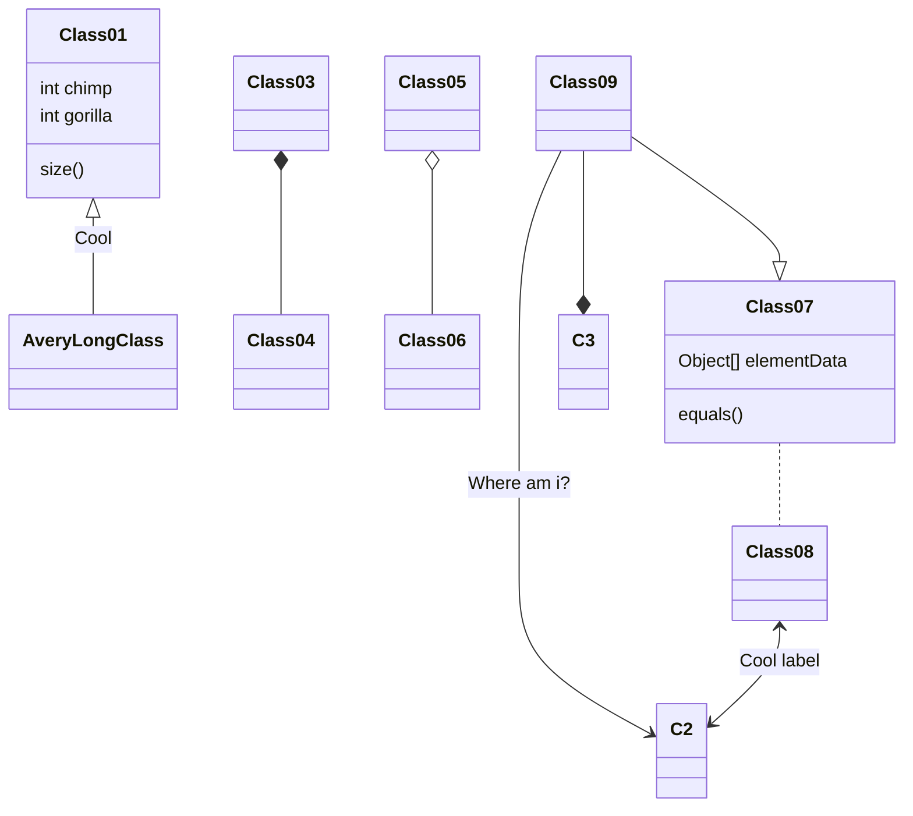

这是我的第一篇博客，记录一下使用 Hexo 的常用构建指令和写作语句。

# Hexo 基础指令
Hexo 是一个快速、简洁且高效的博客框架，使用 Node.js 编写。Hexo 使用 Markdown 解析文章，支持多种主题。具体可参考Hexo 官方文档[^2]。
## 文章相关

### 新建文章

#### 命令行

``` bash
hexo new [layout] <post_name>
hexo new coding helloworld	# example

# 本文设提供推荐可选参数 coding insight life
```
layout 可选参数：post、page、draft，默认为post。post为文章，page为页面，draft为草稿。对应路径分别为`source/_posts`、`source`、`source/_drafts`。

#### 自定义Layout

可以自定义layout充当脚手架，只需要在scaffolds文件夹下创建对应md文件即可。如：`hexo new mylayout <post_name>`，则会在`source/_posts`下寻找`mylayout.md`。并根据其中内容简历文章。




现在项目layout可选参数：post、page、draft、coding、insight、life

其中post、page、draft为Hexo提供的默认参数，分别为po文、分栏级别的页面、草稿文章。

**coding**：编程不辍 - 编程相关文章

**insight**：步履不停 - 思悟相关文章

**life**：生生不息 - 年度总结文章



### 文章配置
Hexo Fluid使用**Front-matter**配置文章，格式支持YAML或JSON两类,详细参数和默认值参考[Front-matter参数](https://hexo.io/zh-cn/docs/front-matter)。

#### YAML

```yaml
---
title: 关于页
layout: about
index_img: /img/example.jpg # 首页中显示的索引图片
banner_img: /image/bg/flower_in_sky.jpg # 文章顶部菜单栏的背景图片
banner_img_height: 70 # 图片参数设置，此处为高度
banner_mask_alpha: 0.3 # 图片参数设置，此处为透明度
date: 2025/7/13 20:46:25 # 文章日期
comment: 'valine'
subtitle: "This is a slogan showing on page top" # 显示在文章顶部的Slogan
excerpt: "hello world" # 显示在首页中的文章简介
categories: # ‘分类’
  - Incessant Coding-编程不辍
tags: [This, b] # ‘标签’
archive: false # 不显示在首页目录，但显示在归档中
hide: false # 不显示文档
math: true # 支持LaTeX数学公式
mermaid: true # 支持mermaid流程图
---
以下是正文内容
```

**YAML格式以---作开头和结尾。**

#### JSON

```json
"title": "Hello World",
"layout": "post"
"date": "2025/7/13 20:46:25",
"math": "true"
;;;
```

**JSON格式仅以;;;结尾**

## 本地调试

Hexo框架为**所见即所得**模式，本地服务器界面如何，远程即如何。

因此完成的文章可于本地调试，然后再更新。

本地服务器采用热更新，实时读取生成静态文件。

#### 命令行

```cmd
hexo server	# 启动本地服务器调试，默认端口4000
```

本地使用hexo server启动服务器，默认端口4000，可使用`hexo server -p 5000`指定端口。本地服务器热更新。

#### 指定端口

```cmd
hexo server -p 5000
```

## 部署

部署完整流程和代码编译类似，需要先清理原生成文件和缓存，并重新编译生成静态文件，然后部署。

部署到remote服务器（如github），需提前在`_config.yml`文件中配置服务器地址。



**注意**：hexo部署应该是只支持SSH连接的，需要提前配置好与服务器的SSH密钥对。



#### 命令行

```cmd
hexo clean	# 清理缓存
hexo generate --deploy  # 生成静态文件并部署
hexo deploy	# 部署到服务器
```

部署前一般使用hexo clean清理缓存，然后需要生成静态文件，最后hexo deploy部署到服务器。

#### 实时生成

```cmd
hexo generate --watch	# 简化generate，便于调试编辑
```


可以使用` hexo generate --watch`命令，可以生成静态文件后，实时监控文件变化，自动重新生成。

#### 一键部署

```cmd
hexo generate --deploy	# 生成并部署
```


使用`hexo generate --deploy`命令，可以简化生成和部署的步骤。

# Hexo 写作语法
Hexo支持大多数文本语法，如Markdown、HTML等。对于Markdown语法，可以参考[^1]，Hexo扩展了Markdown一些功能。
我目前使用的是Hexo Fluid 主题，其在Hexo基础上又封装了一些更方便的语法，具体语法可参考[^3]。

## 行内语法

### 行内图片
这是一张测试图片，语法同Markdown。

说是行内，时间上还是独占一行显示的，在这里只是和Hexo的组图做区别。

用法参见[^1]。

### 脚注

Hexo Fluid在`_config.fluid.yml`主题配置文件中内置支持脚注，关键字`footnote`。

Hexo Fluid中脚注引用只能为数字，并且会统一到参考文献中并自动排序。

#### 语法

```markdown
这是脚注引用1[^1]。脚注引用2[^2]。
[^1]: 这是脚注内容
[^2]: 这是脚注2引用内容
```

和Markdown的脚注其实差不多，甚至还没有Markdown的功能强大，Markdown的脚注支持自定义引用内容。

支持定位，可以以参考文献的形式使用。

#### 示例

这是脚注引用1[^11]。脚注引用2[^22]。
[^11]: 这是脚注11，被自动排到文末参考文献后
[^22]: 这是脚注22，序号自动排列

### 便签
#### 语法

```markdown

text

```

**style**：为便签风格，便签可选类型：primary、default、info、success、warning、danger、light

**text**：为文本，支持Markdown

#### 示例

效果如下：


primary 风格便签，这是里便签内容。



success 风格便签，这是里便签内容。



default 风格便签，这是里便签内容。



info 风格便签，这是里便签内容。



warning 风格便签，这是里便签内容。



danger 风格便签，这是里便签内容。



light风格便签，这是里便签内容。



### 行内便签
#### 语法

```markdown

# 也支持HTML格式
<span class="label label-primary">Label</span>
```

**style**：风格，可选类型primary、default、info、success、warning、danger

**@text**：文本

**注意**：`@text`中的`@`不能省略。

#### 示例

行内便签示例

可选类型效果如下：














## 块级语法

### 折叠块
#### 语法

```markdown

可以折叠任何markdown内容，如代码、图片、文段等

```

**info**: 和行内标签类似的可选参数

**title**: 折叠块上的标题，

注意`@title`中的`@`不能省略

#### 示例

折叠块可折叠代码等内容，示例如下：


info类型

``` python
print("Hello Hexo!")
```




danger类型。

**组图**：








### 勾选框

#### 语法

```markdown
  # 行内
```

**text**：显示的文字
**checked**：默认是否已勾选，默认 false
**incline**: 是否内联（可以理解为后面的文字是否换行），默认 false

#### 示例

**行内用法示例**：，后文不换行。

**行间用法示例**：，前后文换行。

### 按钮

按钮支持Markdown和HTML。

#### 语法

```markdown

# HTML形式
<a class="btn" href="url" title="title">text</a>
```

**url**：跳转链接
**text**：显示的文字
**title**：鼠标悬停时显示的文字（可选）

#### 示例

按钮可以用于跳转链接，用法如下：

可爱捏~

### 组图

不像Markdown中组图需要通过CSS或HTML来实现，Hexo Fluid直接支持组图排版。

#### 语法

```markdown

  
  
  
  
  

```

**total**：图片总数量，对应中间包含的图片 url 数量
**n1-n2-...**：每行的图片数量，，默认单行最多 3 张图，求和必须相等于 total，否则按默认样式

#### 示例

用于把多张图片按一定布局组合显示，示例：





组图模式会自动调整图片大小。

### 流程图

本身Markdown也是支持Mermaid流程图的，Hexo支持流程图需要在配置文件中搜索关键字`mermaid`并设置`enable`为真。

并且使用前需要在**Front-matter**中配置`mermaid: true`。

Mermaid配置项可参考[Mermaid官方API](https://mermaid.js.org/config/usage.html)。

Hexo支持内置Tag和Markdown原生的代码块方式写Mermaid流程图。

#### 语法

内置Tag：

```markdown

gantt
dateFormat  YYYY-MM-DD
title Adding GANTT diagram to mermaid

section A section
Completed task            :done,    des1, 2014-01-06,2014-01-08
Active task               :active,  des2, 2014-01-09, 3d
Future task               :         des3, after des2, 5d
Future task2               :         des4, after des3, 5d

```

Markdown代码块

```markdown


#### 示例


gantt
dateFormat  YYYY-MM-DD
title Adding GANTT diagram to mermaid

section A section
Completed task            :done,    des1, 2014-01-06,2014-01-08
Active task               :active,  des2, 2014-01-09, 3d
Future task               :         des3, after des2, 5d
Future task2               :         des4, after des3, 5d


## 其他
### Emoji :kissing_closed_eyes:
支持的Emoji见[Emoji列表](https://gist.github.com/rxaviers/7360908)
不过对于不同Markdown渲染器，支持的Emoji可能不同，具体可参考，可以使用Unicode编码的Emoji，效果可能更好，如：:art:使用🎨，详细可参考unicode官网[Unicode Emoji列表](https://unicode.org/emoji/charts/full-emoji-list.html)

Windows系统下使用，可以快捷选择Unicode标签，Mac系统则是。

# Markdown语法

更详细的语法可参考Markdown官方语法[^1]。

## 行内语法
删除线：~~删除线~~
下划线：<u>下划线</u>
高亮：<mark style="background-color: #FFFF00">高亮</mark>

框选：- [x] 单选框

行内数学公式：$∇L(θ)$

## 块级语法

#### 块级数学公式：

$$
\textit{θ}:=\textit{θ}−\textit{η}*∇\textit{L}(\textit{θ})
$$

 

**注意**：Hexo本身不支持LaTeX，需要添加依赖：npm install hexo-math --save，并在配置文件中配置。 




# 参考链接
[^1]: [Markdown语法](https://www.markdownguide.org/basic-syntax/)
[^2]: [Hexo官方文档](https://hexo.io/zh-cn/docs/)
[^3]: [Hexo Fluid 主题文档](https://hexo.fluid-dev.com/docs)