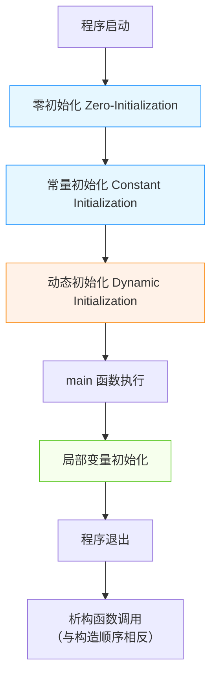

# Hey! *Modern* C++



C++在我看来就像一把蝴蝶刀，可以玩得非常优雅甚至花哨，但你必须留意避免划伤自己。



**Tips**：本文每个概念基本都分成**概述**、**原理**和**应用**三个角度分别从该概念的起源、作用、底层实现和使用方法进行阐述；其中**定义**并非对概念定义的阐述，而是对其底层实现的原理剖析。

**Note**：本文内容均为个人总结，提炼自《Effective C++》、《C++ Primer Plus 6th》等书籍，伴有相关博客的总结，和 AI 生成的内容，以及个人的开发经验。然后，本文尚未完成，也未校正，正持续更新中——2026.8.26

**P.S.**：附一张收藏的C++ meme，幽你一默🙈


## 杂谈

深入C++之前，我们必须牢记这句话“**C++ 不是“防止你犯错”的语言，而是“给你工具，由你负责”的语言**”。C++很多的特性及其引起的潜在风险，主要因为C++不是一种托管语言，它作为系统编程语言更多通过“约定”而非“语法”的方式进行限制。因此C++的使用者享受C++的高控制力、高性能的同时，需要自己遵循这些“约定”。这里我放一段Bjarne老爷子自己对C和C++的锐评——“*C makes it easy to shoot yourself in the foot; C++ makes it harder, but when you do it blows your whole leg off.*”。

那C++会被淘汰吗？我曾经在一篇博文中看到这样一个观点——**“C++的真实趋势应该是越来越倾向于精英化”**。这里精英化是指在可用可不用C++的领域中，C++将被淘汰，而剩下那些必须使用C++的领域通常都是附加值较高、难度较高的领域，比如操作系统、数据库、游戏引擎核心，高性能计算的底层。C++份额的减少我也认为是不可避免的，不过这不应算是C++衰落了，而是大家对C++的预期太高了。C++份额的减少就像经济挤泡沫一样去除了C++不适合的场景。

附各类编程语言信标和份额排行：

- [TIOBE Index - TIOBE](https://www.tiobe.com/tiobe-index/)
- [The Programming Languages Beacon](https://www.mentofacturing.com/vincent/implementations.html)

综上，C++更准确讲是一门系统编程语言，只有深入C++才能称之为C++ developer，否则不过Bug developer甚至是Trouble maker。

## C++溯源

#### C++起源

1. **C with Classes（1983）**:
    - C++ 的最初版本是由Bjarne Stroustrup在贝尔实验室开发的，称为 "C with Classes"。它是基于 C 的扩展，将面向对象编程的概念引入其中。
    - 包含类和基本的继承机制，但没有复杂的模板、异常和标准化库。

#### C++ 的发展阶段

1. **C++98（1998）**:
    - 第一个标准化的 C++ 版本。
    - 引入了标准库，包括 `STL`（Standard Template Library），支持模板编程。
    - 增加了异常处理、命名空间、运行时类型识别（RTTI）、以及新的数据类型和语法特性。
2. **C++03（2003）**:
    - 主要是对 C++98 的修正，规范化了一些未定义行为和库的细节。
    - 没有引入新的语言特性，主要是维护和改进现有标准。
3. **C++11（2011）**:
    - 被称为**“现代 C++”的起点**，引入了大量新特性。
    - 增加了 `auto` 关键字、lambda 表达式、智能指针（`std::unique_ptr` 和 `std::shared_ptr`）、新 的集合类 (`unordered_map`)、以及移动语义。
    - 其他显著变化包括：`constexpr`、`decltype`、`enum class`、增强的初始化列表和范围 `for` 循环。
4. **C++14（2014）**:
    - 对 C++11 的改进和修正。
    - 引入了一些小的语言增强，像是泛型 lambdas、`std::make_unique`、以及宽松的 `constexpr` 规则。
    - 优化了一些标准库组件。
5. **C++17（2017）**:
    - 再次大幅增强语言及库特性。
    - 引入 `std::optional`、`std::variant`、`std::any`、以及文件系统库。
    - 语言方面的改善包括：结构化绑定、`if` 和 `switch` 内的初始化。
6. **C++20（2020）**:
    - 进一步增强了语言能力，特别关注模块化和并行化。
    - 引入概念（Concepts）、模块（Modules）、协程（Coroutines）、范围（Ranges）库。
    - 语言调整包括：三向比较 (`<=>`) 操作符、改进的 constexpr 支持、以及高级协程支持。
7. **C++23（2023）**:
    - 最近发布的标准，进一步改善了泛型和模板编程并增强了标准库。
    - 包括更智能的模式匹配、新的输入输出库、以及持续对模块的改进。
    - 继续在语言层面增加便利性特性和性能优化。

Bjarne Stroustrup在C++标准演进中遵循**“We don’t break user code.”**的思想，因此C++的发展有很强的历史遗留问题，新的功能和特性几乎是必须兼容旧版。这导致很多现代语言普遍的优秀的特性，如包管理等，都没有很好的支持。即使C++20引入了模块的概念，但至今（25年）依然没有很好的实践，很多第三方库也没有支持模块化。

关于C++的起源和发展，可以直接访问Stroustrup老爷子的主页——[Bjarne Stroustrup](https://www.stroustrup.com/index.html)，其中有更全面的说明，...，和彩蛋🫣。

## 所谓面向对象

> C++ = C + Classes + Morden Features，not C艹

面向对象是C++与C间最大的区别，这使得两者从理念上成了完全不同的语言。而Morden Features也是从Classes这个概念衍生而出的。

### 继承

#### 概述

继承、封装、多态可谓面向对象的核心概念。从继承概念中衍生出了作用域的概念。（或者说，从对象这个概念本身。正是有了对象才有继承，可以说继承的概念也是从对象的概念中衍生而来的）。C++中，继承行为有三种方式，`public`、`protected`、`private`，三者和对象内部的作用域相对应。三者区别如下：

- **Public继承行为**：
    - **public 成员**：在派生类中仍是 `public`。
    - **protected 成员**：在派生类中仍是 `protected`。
    - **private 成员**：不可直接访问。但可以通过基类的 `public` 或 `protected` 方法进行间接访问。
- **Protected继承行为**：
    - **public 成员**：在派生类中变为 `protected`。
    - **protected 成员**：在派生类中保持 `protected`。
    - **private 成员**：不可直接访问。
- **Private 继承行为**：
    - **public 成员**：在派生类中变为 `private`。
    - **protected 成员**：在派生类中也变为 `private`。
    - **private 成员**：不可直接访问。

#### 虚函数表

> 关于虚函数表本来打算放到函数一节再讲的，但想到其和继承的关联更大，于是放在此处

**概述**

前文有提到，面向对象的核心概念——继承、封装、多态（老生常谈、耳鬓磨茧）。正是因为有了对象的概念，才得以引出了继承的概念。据此可以合理推广一下，正是有了继承，才有了多态，**多态脱胎于继承**。直观讲，引入多态是为了解决从基类调用子类的方法这个问题。同一方法在基类和子类中有不同的逻辑，其**多态**便呼之欲出了。

**原理**

在C++底层，通过一张**虚函数表**将基类和子类的虚函数关联起来，在调用某函数时会根据该表查到对应的函数指针并调用。很明显，虚函数表不需要随子类的实例化而实例化，因为该表在编译完成后不会再变动，所以事实上每个子类的实例只需要持有一个**虚函数指针**用以指向**虚函数表**。两者细节如下：

1. **虚函数表（VFT，Virtual Function Table）**：
    - 在 C++ 中，如果一个类有一个或多个虚函数，编译器会为这个类创建一个虚函数表。这个表中包含指向该类所有虚函数实现的函数指针。
    - 虚函数表用于在运行时实现动态多态，即当你在派生类对象上调用虚函数时，通过虚函数表找到正确的函数实现。
2. **虚函数指针（VFP，Virtual Function Pointer）**：
    - 由于每个对象都可能有不同的类继承层次，必须有一种机制让对象能够访问它的虚函数表。这就是虚函数指针。
    - 每个对象的内部一般都会有一个隐藏的指针成员，指向该对象所属类的虚函数表。

若你使用VS或者VS Code，那你在debug时会注意到某个类实例常拥有一个名为 `__vfptr`的指针，它便是虚函数指针。其`__`前缀表示内部属性（是的，就像Python那样），`vf`即Virtual Function，`ptr`指pointer。

因此，C++语言中的`virtual`和`override`关键字可以理解成在为该类实现**虚函数表**的编译器标志符号。

#### 虚继承

> 都是菱形继承惹的祸

**概述**

考虑这样一种情况，类B和类C都继承自类A，类D菱形继承类B和类C。在这种情况下类D就具有两个重复的基类A，若具有特殊的成员变量，这意味着D会持有两份，使用时会造成二义性和性能损失。虚继承就是为了解决这个问题的。

**虚继承（virtual inheritance）**是C++中解决菱形继承引起的重复基类实例问题的一种手段。虚继承可以确保基类的成员在最终派生类中只存在一份拷贝，从而避免数据冗余以及二义性。从根本上讲，虚继承是为了解决菱形继承的数据冗余和二义性的，所以**菱形继承纯虚接口时不需要考虑虚继承的问题**，因为纯虚接口仅提供方法定义，所以接口都使用同一个虚函数表，不存在二义性，也不存在成员数据。

**原理**

虚继承的实现和虚函数表类似，因为虚函数和虚基类的偏移量在编译期计算不了（偏移量的具体值是由最终派生类决定的动态运行对象来确定的，这就是多态），必须在运行时确定。所以所有使用虚继承的对象会额外包含一个**虚基类指针**用于指向**虚基类表**，用于在运行时间接按表查询偏移量。两者细节如下：

1. **虚基类表（VBT，Virtual Base Table）**：
    - 如果一个类继承了被`virtual`修饰的虚基类，则编译期会为其创建一个虚基类表。该表存储了从当前对象到各个虚基类的偏移量
2. **虚基类指针（VBP，Vietual Base Pointer）**：
    - 指向虚基类表，在MSVC中一般通过`__vbptr`表示

在内存布局上更有意思，虚基类子对象不像“常规继承”那样呈现**“嵌套包含”**的结构，所有的子对象会共享同一个虚基类实例。虚继承时的虚基类实例在内存布局上，一般会被置于整个实例内存的最后（或者单独的区域，虚基类表会存储位置偏移量）。虚基类内存布局后置，实际上不是先创建再移动，为了保证虚基类只被初始化一次，虚基类是在**最派生类（most-derived class）**即最后的派生类实例化时才实例化的。

**应用**

虚继承的使用示例如下：

```C++
class A { public: int x; };
class B : virtual public A {};   // ← 虚继承
class C : virtual public A {};   // ← 虚继承
class D : public B, public C {};

D d;
d.x = 1; // 只有一个 A::x
```

补充一点，在C#和Java等编程语言中不存在虚继承，因为它们的继承策略是：单基类继承+多接口继承，这从设计上就避免了菱形继承可能引起的问题。

另外，从架构设计上讲，**组合 > 继承，接口 > 实现继承**，菱形继承本身就是非必须则不用。

#### 多态

**概述**

多态本身已经没什么好翻出来讲的了，它就像个被掏空的口袋。这里我想讲一种设计理念或者编程技术——**编译期多态**（也称静态多态）。一般的多态行为，都会导致运行时开销增加，比如虚表、虚指针和偏移计算等。

**CRTP（Curiously Recurring Template Pattern，奇异递归模板模式）**是C++中一种**编译期多态**的经典实现方案。核心就是将派生类作为模板参数传递给基类，这种奇特的反向传递方式也是其名“Curiously”的由来。

**原理**

CRTP本质上是依赖了C++强大的模板泛型能力，由于模板在编译期推断类型，所以该方式不会增加运行时开销，实现一种**零成本多态**。

```C++
template <typename Derived>
class Base {
public:
    void interface() {
        // 调用派生类的实现
        static_cast<Derived*>(this)->implementation();
    }
};

class Derived : public Base<Derived> {  // ← 派生类把自己传给基类！
public:
    void implementation() {
        std::cout << "Derived implementation\n";
    }
};
```

将基类声明为一个带模板参数的模板类，由于派生类将自己传递给基类（**派生类实际继承的是`Base<Derived>`而非`Base`**），此时基类知道了派生类的完整定义，所以在接口实现中可以直接静态转换类型，实现对子类方法的调用。

**应用**

编译期多态在实现静态接口、提升性能等方面有非常重要的实践意义。以基类统一运算符的重载为例：

```C++
template<typename Derived>
struct Comparable {
    bool operator!=(const Derived& other) const {
        return !(*static_cast<const Derived*>(this) == other);
    }
    bool operator<=(const Derived& other) const {
        return (*static_cast<const Derived*>(this) < other) ||
               (*static_cast<const Derived*>(this) == other);
    }
    // ... 其他运算符
};

class Point : public Comparable<Point> {
    int x, y;
public:
    bool operator==(const Point& p) const { return x == p.x && y == p.y; }
    bool operator<(const Point& p) const { /* ... */ }
};
// 现在 Point 自动支持 !=, <=, >, >= !
```

基类可以几乎以内联的形式访问派生类成员，对于一些高性能场景如图形渲染内核，我们可以将频繁调用的渲染相关方法实现为静态接口。示例如下：

```C++
template<typename Derived>
struct Drawable {
    void draw() {
        static_cast<Derived*>(this)->doDraw();
    }
};

struct Circle : Drawable<Circle> {
    void doDraw() { /* ... */ }
};

struct Square : Drawable<Square> {
    void doDraw() { /* ... */ }
};
```

**切片对象**

切片对象是指对于一个接收基类的方法通过按值传递派生类时会导致的多态性失效现象。底层来讲，按值传递时之所以多态性失效，是因为此时发生了拷贝构造，传入的派生类参数，通过拷贝构造的方式创造出了一个基类形参实例，在函数作用域内起效的实际是一个新的基类形参实例。因此也就没有多态可言了。

### 函数

#### 函数对象

> 面向对象语言中，应该理解任何事务都是对象，函数也例外。

函数对象也称仿函数，functor。函数对象是一个重载了函数调用运算符`operator()`的类或结构体实例。它的行为类似于函数，但它是一个对象，因此可以携带状态（即成员变量）。

在 C++ 中，任何重载了` operator()` 的类或结构体都可以作为函数对象使用。由于` struct` 默认是 `public` 的，因此它通常被用来定义简单的函数对象。如下代码示例：

```C++
// 函数对象（Functor）
struct Adder {
    int addend;
    Adder(int x) : addend(x) {}
    int operator()(int x) const { return x + addend; }
};
class Multiper {
    int multi;
  public:
    Multiper(int x) : multi(x) {};
    int operator()(int x) const { return x*multi; }
}
```

**总结**：如果一个对象可以使用`()`的方式来调用，那它就可以视为一个函数对象。因此广义上，基础函数对象（重载操作符的`struct`和`class`）、函数指针、Lambda、`std::function`包装的对象都可称之为函数对象。

#### 函数指针

> 如同其它数据类型一样，既然有函数对象，那意味着也有函数指针。

函数指针是 C/C++ 中一个**基础但极其强大**的特性，它不仅是语言设计的核心思想之一，更是许多高级机制（如回调、事件系统、动态库、多态等）的基石。

**目的**：函数指针是要是为了实现高级机制，比如运行时选择行为、解耦调用与实现、回调等。

**定义**：函数指针也是一个指针变量，但它存储的是某个函数在内存中的入口地址。

**语法**：调用函数指针 ≈ 直接调用（可能略慢于内联），毕竟都是直接在内存操作。函数指针的使用，可以省去取地址&、解引用*符号，这和其它指针有一定区别。具体语法如下：

> 1、C风格写法
>
> ```C++
> // 定义一个函数指针类型：指向返回 int、接受两个 int 的函数
> int (*func_ptr)(int, int);
> 
> // 使用
> int add(int a, int b) { return a + b; }
> func_ptr = &add;        // 取地址（& 可省略）
> int result = func_ptr(3, 4); // 调用（等价于 (*func_ptr)(3,4)）
> ```
>
> 2、使用别名
>
> ```C++
> // typedef
> typedef int (*MathFunc)(int, int);
> MathFunc op = add;
> 
> // C++11 引入了using
> using MathFunc = int(*)(int, int);
> ```
>
> 3、用作参数
>
> ```C++
> void call_operation(int a, int b, int (*op)(int, int)) {
>     op(a, b);
> }
> ```

**实现**：现代计算机架构基于**冯·诺依曼体系**，其一大特点是程序指令和数据存储在同一内存空间。这意味着，函数存储内存中，也具有内存地址，所有可以通过指针指向它，这是函数指针得以实现的基础。

**应用**：以回调函数为例，可以使用函数指针作为参数，实现回调的功能。示例如下：

> ```C++
> // 库函数：遍历数组并回调
> void for_each(int* arr, int n, void (*callback)(int)) {
>     for (int i = 0; i < n; i++) callback(arr[i]);
> }
> 
> // 用户代码
> void print(int x) { printf("%d\n", x); }
> 
> for_each(data, 10, print); // 注册回调
> ```
>
> 补充一个动态加载DLL，也可理解位**插件系统**
>
> ```C++
> // 从 DLL 加载函数
> void* handle = dlopen("plugin.so", RTLD_LAZY);
> auto plugin_func = (int(*)(const char*))dlsym(handle, "process");
> plugin_func("input");
> ```

**发展**：函数指针也存在不少局限性，随着C++的演进，也提出了针对性的解决方案。具体如下表：

| 局限                 | 现代解决方案                |
| -------------------- | --------------------------- |
| 不能捕获局部变量     | `std::function` + Lambda    |
| 语法复杂             | `auto` + Lambda             |
| 无类型安全（C 风格） | `std::function<R(Args...)>` |

使用Lambda代替函数指针的示例：

> ```C++
> // 旧方式
> void register_callback(void (*cb)(int));
> 
> // 新方式
> #include <functional>
> void register_callback(std::function<void(int)> cb);
> 
> // 使用
> int factor = 2;
> register_callback([factor](int x) { 
>     cout << x * factor; // 捕获了 factor！
> });
> ```

#### 函数体系

> C++里函数体系也呈三足鼎立之势：pointer of function、lambda、std::function

前文提到函数指针也存在局限性，C++的发展中提供了很多现代解决方案。据此引出Modern C++里的函数体系，这个体系里分别有**函数指针**、**Lambda表达式**和**std::function**。三者像依次递进的阶梯，助力C++迈向Modern。

**function pointer**：最原始、最轻量的“可调用实体”，只能指向普通函数或静态函数。

**lambda**：编译器生成的**匿名仿函数类（functor）**，可捕获上下文，比函数指针强大得多。其底层是由生成唯一的结构体，若不存在捕获，则还会生成一个函数用于转换（退化）函数指针。

**std::function**：类型擦除（type-erased）的**通用包装器**，可以存储任意可调用对象（包括函数指针、Lambda、成员函数等）。其底层是**虚函数调用**或**函数指针+上下文指针**。

**区别**：如下表

| 概念                | 本质                 | 使用场景                            |
| ------------------- | -------------------- | ----------------------------------- |
| **函数指针**        | 内存地址             | C 兼容、高性能、无状态回调          |
| **Lambda**          | 匿名仿函数对象       | 现代 C++ 首选，灵活、可捕获、可内联 |
| **`std::function`** | 类型擦除的通用包装器 | 需要统一接口、存储任意可调用物      |

**总结**：函数指针直接指向可调用对象；为了解决函数指针不可捕获、内联，引入了Lambda；为了保存成员函数（存在一个内置的this函数指针）、统一类型等更通用的场景，引入了`std::function`。

#### 函数绑定

> 从前文对函数体系的简述中可发现，函数对象及其应用的越发复杂，这导致了对函数绑定的需要。

为什么需要对函数进行绑定？

**目的**：在C++11之前（如C++98/03），函数的绑定通过`std::bind1st`和`std::bind2nd`实现，但该方法仅能绑定二元函数，且不够灵活。因此，在C++11中引入了`std::bind`，提供一个通用、灵活、可组合的**函数绑定机制**，支持任意参数数量、任意位置绑定、成员函数绑定，并能生成新的可调用对象。

**定义**：`std::bind` 是一个函数模板，用于将可调用对象（函数、Lambda、成员函数等）与其部分参数“预绑定”，生成一个新的可调用对象（callable）。

**语法**：基本语法如下

```C++
#include <functional>
auto bound = std::bind(f, arg1, arg2, ..., argN);
```

其中：

- `f`：可调用对象（函数、Lambda、成员函数指针等）
- `arg1...argN`：可以是：
    - 具体值（立即绑定）
    - 占位符（`std::placeholders::_1`, `_2`, ...）表示“后续调用时传入的参数”

**原理**：简单来说，`std::bind`的类型擦除机制即一个模板类， 底层通过元编程生成一个**未指定类型的可调用对象**（通常是一个仿函数类），其 `operator()` 实现了参数转发和占位符替换。`std::bind`和`std::placeholders`的实现示例如下：

```C++
// 简化版实现思路
template<typename F, typename... Args>
class binder {
private:
    F f_;                    // 存储可调用对象
    std::tuple<Args...> args_; // 存储绑定的参数
    
public:
    template<typename... CallArgs>
    auto operator()(CallArgs&&... cargs) {
        // 调用helper函数，处理参数绑定和调用
        return call_helper(std::index_sequence_for<Args...>{},
                          std::forward<CallArgs>(cargs)...);
    }
};

namespace std::placeholders {
    // 实际上是一些整型常量
    constexpr _1;  // 对应第一个调用参数
    constexpr _2;  // 对应第二个调用参数
    // ... 最多到 _N（通常是 _29）
}
```

**应用**：示例如下

```C++
#include <functional>
#include <algorithm>
#include <vector>

bool is_between(int x, int low, int high) {
    return x >= low && x <= high;
}

int main() {
    std::vector<int> nums = {1, 5, 10, 15, 20, 25};
    
    // 创建谓词：检查是否在[10, 20]之间
    auto between_10_and_20 = std::bind(is_between,
                                      std::placeholders::_1,
                                      10, 20);
    
    int count = std::count_if(nums.begin(), nums.end(),
                             between_10_and_20);
    // count = 3 (10, 15, 20)
}
```

**发展**：除了业务场景下需要通用的接口（等我更熟悉`std::bind`也业务场景后会有更详细的梳理），C++11起更推荐使用Lambda表达式。

#### 函数可变参数

> 暂时放到这里，本小节后续会移动到更合适的地方

C语言时代就支持函数可变参数，再C++中既可使用C风格的函数可变参数，也可以使用C+++的新特性。

**概述**：C的可变参数机制是在C语言第一个标准化版本C89（也称为ANSI C）中就已引入的。主要解决了在标准输入/输出库以及许多其他库设计中常见的需求，即函数需要能够处理不定数量和类型的参数。

**语法**：头文件`#include <stdarg.h>`，C++中为`#include <cstdarg>`。主要类型为`va_list`，相当于当前可变参数列表的指针。支持的宏如下：

| 宏/类型                        | 作用                                 |
| ------------------------------ | ------------------------------------ |
| `(ap, last_fixed_param)`       | 初始化 `va_list`，必须在函数开头调用 |
| `va_arg(ap, type)`             | 获取下一个参数，需指定类型           |
| `va_end(ap)`                   | 清理 `va_list`，必须在函数返回前调用 |
| `va_copy(dest, src)`（C99 起） | 复制 `va_list`（用于多次遍历）       |

**原理**：

- **底层实现原理**：可变参数的实现依赖于栈上的参数传递机制。通常，函数的参数是按序压入栈中，并且使用相同的约定（例如，右到左）。这使得可以通过地址偏移访问后续的参数。
- **方式**：`va_list` 等宏其实是对指针操作的封装，`va_start` 设置 `va_list` 指向参数栈帧的开头，然后使用 `va_arg` 及偏移提取参数。在一些平台上实现可能会使用寄存器，但概念上仍是通过指针遍历参数。
- **注意**：具体的实现会依赖平台（硬件和编译器），例如：典型 x86-64 使用寄存器传递前几个可变参数，然后是栈传递，在这种情况下，变长参数处理必须考虑这些不同的平台调用约定。

**应用**：如下示例：

```c++
#include <stdio.h>
#include <stdarg.h>

double average(int count, ...) {
    va_list args;
    va_start(args, count);  // 从 count 后开始读取

    double sum = 0.0;
    for (int i = 0; i < count; i++) {
        sum += va_arg(args, int);  // 每次取一个 int
    }

    va_end(args);
    return count > 0 ? sum / count : 0.0;
}

int main() {
    printf("Avg: %.2f\n", average(4, 10, 20, 30, 40)); // 输出 25.00
    return 0;
}
```

类似地还有C风格的`printf`、`scanf`等（还包括测试框架，比如GTest的很多断言宏就使用了可变参数机制和`__VA_ARGS__`宏），就是典型地通过函数可变参数实现的。

**发展**：C语言下的函数可变参数始终是类型不安全的，C++引入了`std::initializer_list`和可变参数模板来实现类型安全的可变参数现代替代方案。

### 智能指针

> 智能指针多智能？

首先智能指针是区分于裸指针这个概念的，所谓裸指针就是使用new直接创建的指针，由开发者手动管理声明周期。在C++98中就引入了智能指针，`auto_ptr`，随后C++11中扩充到了`unique_ptr`（用于代替`auto_ptr`）、`share_ptr`等等。智能指针最核心的一点就是为了避免手动管理生命周期，或者说，智能指针本身被创造出来就是为了解放开发者对生命周期的管理。实际上直接对指针的操作，手动管理生命周期常常是危险的（回收本文首页的Trouble Maker😫）。

`std::unique_ptr<T>`：

- **引入版本**：C++11
- **所有权类型**：**独占所有权**（Exclusive ownership）
- **支持复制**：❌ 仅可移动（move-only）
- **线程安全**：控制块本身无共享，无需同步；但被管理对象的线程安全需用户保证
- **使用场景**：默认使用 `delete`，支持自定义删除器（deleter）
    - 资源 RAII 管理
    - 函数返回堆对象
    - 容器中存储动态对象（如 `vector<unique_ptr<T>>`）
    - 替代裸 `new/delete`

`std::shared_ptr<T>`：

- **引入版本**：C++11
- **所有权类型**：**共享所有权**（Shared ownership）
- **支持复制**：✅ 可复制（引用计数增加）
- **线程安全**：**引用计数操作是原子的**（线程安全），但被管理对象本身不是线程安全的
- **使用场景**：内部有控制块（control block），含引用计数、弱引用计数、删除器等
    - 多个对象/模块共享同一资源
    - 对象生命周期不确定（如事件回调、缓存）
    - 需要“谁最后用完谁释放”语义

`std::weak_ptr<T>`：

- **引入版本**：C++11
- **所有权类型**：**观察者（无所有权）**
- **支持复制**：✅ 可复制
- **线程安全**：与 `shared_ptr` 共享控制块，引用计数操作线程安全
- **使用场景**：必须通过 `.lock()` 转为 `shared_ptr` 才能访问对象
    - 打破 `shared_ptr` 循环引用
    - 缓存系统（判断对象是否还存活）
    - 临时访问共享对象而不延长其生命周期

`std::auto_ptr<T>`：

- **引入版本**：C++98
- **所有权类型**：**独占所有权**（Exclusive ownership）
- **支持复制**：✅（但复制会转移所有权，违反直觉）
- **线程安全**：不支持
- **使用场景**：C++11 起标记为`deprecated`，C++17 起**完全移除**

#### 生命周期管理

| 方法/操作       | 适用智能指针               | 作用                                         |
| --------------- | -------------------------- | -------------------------------------------- |
| `reset`         | `unique_ptr`, `shared_ptr` | 释放当前对象并接管新对象（可选）。           |
| `swap`          | `unique_ptr`, `shared_ptr` | 交换两个智能指针的管理对象。                 |
| `get`           | `unique_ptr`, `shared_ptr` | 返回原始指针（裸指针）。                     |
| `release`       | `unique_ptr`               | 释放所有权并返回原始指针（不销毁对象）。     |
| `use_count`     | `shared_ptr`               | 返回引用计数。                               |
| `unique`        | `shared_ptr`               | 检查是否只有一个 `shared_ptr` 实例管理对象。 |
| `operator*`     | `unique_ptr`, `shared_ptr` | 解引用，访问管理的对象。                     |
| `operator->`    | `unique_ptr`, `shared_ptr` | 访问管理对象的成员。                         |
| `operator bool` | `unique_ptr`, `shared_ptr` | 检查智能指针是否非空。                       |
| `make_unique`   | `unique_ptr`               | 创建并初始化 `unique_ptr`。                  |
| `make_shared`   | `shared_ptr`               | 创建并初始化 `shared_ptr`。                  |

#### 资源管理

deleter

对于`get_deleter`和`deleter`使用的官方Example，如下：

```C++
#include <iostream>
#include <memory>
 
struct Foo
{
    Foo() { std::cout << "Foo() 0x" << std::hex << (void*)this << '\n'; }
    ~Foo() { std::cout << "~Foo() 0x" << std::hex << (void*)this << '\n'; }
};
 
struct D
{
    int number;
 
    void bar()
    {
        std::cout << "call D::bar(), my number is: " << std::dec << number << '\n';
    }
 
    void operator()(Foo* p) const
    {
        std::cout << "call deleter for Foo object 0x" << std::hex << (void*)p << '\n';
        delete p;
    }
};
 
int main()
{
    std::cout << "main start\n";
 
    std::unique_ptr<Foo, D> up1(new Foo(), D(42));
    D& del1 = up1.get_deleter();
    del1.bar();
 
    std::unique_ptr<Foo, D> up2(new Foo(), D(43));
    D& del2 = up2.get_deleter();
    auto* released = up2.release();
    del2(released);
 
    std::cout << "main end\n";
}
```

输出结果为：

```latex
main start
Foo() 0x0x90cc30
call D::bar(), my number is: 42
Foo() 0x0x90cc50
call deleter for Foo object 0x0x90cc50
~Foo() 0x0x90cc50
main end
call deleter for Foo object 0x0x90cc30
~Foo() 0x0x90cc30
```

说明：

1. deleter是类内类，即不同智能指针的deleter是不同类型
2. 可以手动获取deleter并释放该智能指针管理的资源
3. 正常智能指针生命周期到期并释放时，会通过deleter释放被管理资源
4. 同1，deleter会增加开销，一般会多一个指针专门指向deleter

#### 类型转换

开发更复杂的应用时会遇到对智能指针进行类型转换的场景，如从基类指针转向派生类指针。标准库提供了一个`std::static_pointer_cast<>()`方法用于将共享指针安全地转换为目标指针，如将`std::shared_ptr<Parent>`转换为`std::shared_ptr<Derived>`。

至于为什么仅对共享指针进行转换？这是因为共享指针生命周期管理比较特殊，直接的转换不涉及对管理控制块的更改，可能导致该共享指针引用计数为0使得管理的对象提前被释放。而其它智能指针不存在这个问题。这里就涉及到了使用智能指针，尤其是存在类型转换的情景时，对智能指针尤其是其内存控制块的管理，这也是需要留意的地方。

### 类型

> Type

#### 字符串

##### 概述

C中的字符串为`char *`类型，C++中提出了`std::string`。当然，C++毕竟基于C，因此C++中支持`char*`和`std::string`。在现代C++还引入了更多的字符串类型，如C++17引入的`std::string_view`（回归了早期C++中字符串完全类似指针的逻辑，比如不持有字符内存，仅观察一段内存的字符串）、C++20引入的`char8_t` 和 `u8string`（主要用于明确UTF-8的编码模式）。

对于`char`类型需要记住的就是，其只占1个字节（所有平台都是1个字节），C风格下的字符串使用`char`数组的形式。好，在更细致地分析潜在的`const char *`之前，我们先简单聊聊`std::string`。

从C++11起，字符串的存储必须是连续的，即`&s[0]` 到 `&s[s.size()-1]` 是连续内存。这么做两点历史原因

1. 便于`std::string`到`char *`的快速转换；
2. 解决旧的字符串存在的线程安全问题（可以简单理解为过去的字符串是浅拷贝的，现在则是深拷贝）

##### 原理

出于性能优化考量，`std::string`提出了一种特殊的内存管理策略——小字符串优化（SSO, Small String Optimization），对于小字符串直接在栈区分配，而大字符串则在堆区生成并使用`char *`的指针来指向。`std::string`的定义可以简化如下：

```C++
class string {
    union {
        char local_buffer[N];   // 小字符串：直接存在对象内部（栈上）
        struct {
            char* ptr;          // 大字符串：指向堆内存
            size_t size;
            size_t capacity;
        } heap_info;
    };
    // + 一些标志位判断当前使用哪种模式
};
```

##### 应用

尽管绝大多数情况使用`std::string`，C++中依然大量存在使用`char *`的场景。甚至多到违反直觉，比如所有临时创建的字符串其实都是`const char*`类型，因此对于很多接收`std::string`类型的方法，很可能存在一次潜在的类型转换（存在一次`std::string`的构造函数）。示例如下：

```C++
class Widget {
public:
    void setName(const std::string& newName)    //用const左值设置
    { name = newName; }
    
    void setName(std::string&& newName)         //用右值设置
    { name = std::move(newName); }
    
    …
};
w.setName("Adela Novak");
```

这里直接传入一个字符串，实际传入的是一个`const char*`类型，因此这里有一个中间的隐式转换，先创建一个临时的`str::string`并绑定到形参。

#### 限域枚举

**概述**：强类型枚举（**Scoped Enumeration**，也称限域枚举）自C++11引入，用于提高类型安全性和命名空间的封闭性。其与原枚举类型最大的区别在于：

1. 命名空间封闭：访问时必须显式引用作用域（原枚举成员均暴露在定义枚举的作用域中，易引起名称冲突）
2. 类型安全：禁用同类型的隐式转换，必须显式转换
3. 底层类型明确：可自定义枚举类型值，默认为int型，采用继承方式

**值初始化**：值初始化是C++98就引入的一种对枚举类型增强的能力，可以指定具体枚举类型的值，用于实现一些更复杂的操作，如位运算等。限于枚举更高级的地方在于，可以手动指定枚举类型的值。但值初始化容易忽略的一点就是`auto type = MyENUMClass();`，此时不是调用枚举类型的构造函数（枚举类型不是类，也没有构造析构函数），这里其实是在进行*值初始化*，此时使用*零值初始化*，得到一个枚举类型底层值位0的类型。

若当前枚举类型不存在底层类型为0的值，也会返回0，而且不会报错和抛异常，注意留意！**C++允许枚举变量持有不在枚举列表中的值（只要在底层类型范围内）**。换个角度，这也是为什么默认的枚举类型值建议设置为0。

**用法示例**：

```c++
enum class ErrorCode : unsigned int {
    NotFound = 404,
    Forbidden = 403
};

// 必须进行显式转换：
unsigned int number = static_cast<unsigned int>(ErrorCode::NotFound);
// 必须使用作用域运算符
ErrorCode type = ErrorCode::Forbidden;
// 默认值初始化，也称零值初始化
ErroCode initial_type = ErrorCode();
```

#### 结构体

> `struct`和`class`，李鬼和李逵

其实大部分初学者都存在一个误区，`struct`和`class`不同，不支持多态和继承、在内存层面`struct`比`class`更高效。实际上，C++标准中明确地说除了默认访问和继承权限，`struct`和`class`可以互换，原文如下：

> “The keywords `struct` and `class` are interchangeable except for the default access and inheritance.”

在C++中`struct`的功能已经完全等同于`class`，唯二的区别就是**访问控制权限不同**和**`struct`不支持模板参数**。

`class`与`struct`的区别：

1. **默认继承访问权限**：`class`为`private`，`struct`为`public`
2. **默认控制访问权限**：`class`为`private`，`struct`为`public`
3. **模板参数**： `class`支持模板，而`struct`不支持

`class`为对象的实现强调独立的对象，`struct`作为数据结构的实现强调组合的数据，因此两者在访问控制权限存在不同。既然`class`完全可以替换`struct`，两者在内存管理上甚至也没有区别，C++为何还要保留`struct`关键字？主要是一种设计理念的区分，数据用`struct`、对象用`class`。但在我看来，C++毕竟是一个历史包袱重的语言，这种保留主要还是为了兼容C（需留意面向C时`struct`也得使用C的语法）。

**注意**：内存管理上，两者在生成的**内存布局**、**对齐**、**访问指令**连**虚表**都是一致的，甚至反汇编代码的话是无法区分一个类型使用的是`struct`还是`class`

#### 类型转换

C++一共有四种类型转换方式，分别是：

1. **隐式类型转换**

    隐式类型转换由编译器根据上下文推断进行，没有显示的编码。但可能会导致精度丢失或错误行为，例如从浮点数转换为整数时丢失小数部分。

2. **显式类型转换 (C风格)**

    通过类型转换操作符 `(type)` 明确指定类型转换的方式，俗称 **C风格类型转换**。这种转换不做额外的安全检查，尤其是涉及继承关系或复杂类型时。

3. **C++ 强制类型转换**（`static_cast`, `dynamic_cast`, `const_cast`, `reinterpret_cast`）

    理解类型转换的命名，或许对理解强制类型转换也有帮助。剑桥词典中，对Cast有如此释义：

    > [Cast]([CAST在剑桥英语词典中的解释及翻译](https://dictionary.cambridge.org/zhs/词典/英语/cast))： “**to make an object by pouring liquid, such as melted metal, into a shaped container to become hard**”

    因此，不难理解为强制类型转换关键字都是以`_cast`结尾了，甚至说非常生动。

    - `static_cast`用于进行**显式类型转换（C++风格）**，适用于基本数据类型之间的转换以及具有明确转换规则的类型（如类之间的显式转换）。

        **`static_cast`是运行时开销最小的一种类型转换，但是在类层次关系中可能非常危险，因为它是编译期执行的转换，忽略了对象类型的实际情况。**

    - `dynamic_cast`主要用于安全地在**继承关系**的类层次之间进行类型转换。它只能用于有**虚函数**的类（即支持RTTI, Runtime Type Information）。如果转换失败，`dynamic_cast`会返回指针类型的`nullptr`，或者抛出`std::bad_cast`异常（当操作的是引用类型）。

        **`dynamic_cast`通常用于需要检查派生类的类型安全的场景，虽然灵活，但其运行时性能开销较大，尤其是继承树非常深的情况。**

    - `const_cast`用于移除或添加对象的`const`或`volatile`属性。它在修改传入的`const`对象时特别有用，但必须谨慎使用，因为修改`const`对象可能导致未定义行为。实际上，**`const_cast`只能用于修改对象的`const`属性，不参与真正的类型转换。**

    - `reinterpret_cast`是一种**非常危险的类型转换**，它用于把一种类型彻底重解释为另一种完全不相关的类型。它通常用于底层硬件操作、内存地址转换等场景。

4. **构造函数或赋值操作中实现的类型转换**

选择正确的类型转换方式非常重要，应尽量使用强制类型转换（如 `static_cast` 和 `dynamic_cast`），以提高代码的类型安全性和可读性，同时避免不必要的隐式转换和滥用不安全的转换方式（如 `reinterpret_cast`）。

#### 编译期与运行时

> 由于编译期、运行时本质上是和类型强相关联的，因此放于此节

对于编译期和运行时的认识我经历了三个阶段：

1. 模糊的认识：仅知道编译期的概念，知道宏相关操作都发生在编译期
2. 初步的接触：在接触了模板和`constexpr`等知识再一次认识
3. 茫然无措：突然发现自己其实并不能明确地区分编译期与运行时，或者什么时候该用编译期语法什么时候该用运行时语法。

这个认识的过程其实是感性认识逐渐发展到需要理性抽象的过程，呈现出波谷的学习曲线（大部分人应该都经历过），这也是我写这一小节的初衷。

根本原因：指针/引用的静态类型 ≠ 动态类型， 只有操作数的静态类型（static type）就是其动态类型（dynamic type），偏移就可在编译期确定。

**如果表达式的静态类型足以确定行为则在编译期，反之如果必须依赖动态类型则在运行期。**比如接收通用基类的方法，方法中需要使用某个具体派生类中的成员时一般需要类型转换，但此时接收的是通用基类，其实际类型可能不是我们需要的具体派生类。

## 操作符

> C++不仅支持函数重载，还支持操作符重载

### 重载

C++中使用关键字`operator`重载操作符我只能说强得可怕，可以自定义类的更丰富行为。下面列举了C++中支持重载的操作。

- **算术运算符**
    - `+`：加法运算符
    - `-`：减法运算符
    - `*`：乘法运算符
    - `/`：除法运算符
    - `%`：取模运算符
- **关系运算符**
    - `==`：相等运算符
    - `!=`：不等运算符
    - `<`：小于运算符
    - `>`：大于运算符
    - `<=`：小于等于运算符
    - `>=`：大于等于运算符
- **逻辑运算符**
    - `!`：逻辑非
    - `&&`：逻辑与
    - `||`：逻辑或
- **按位运算符**
    - `&`：按位与
    - `|`：按位或
    - `^`：按位异或
    - `~`：按位取反
    - `<<`：左移位
    - `>>`：右移位
- **赋值运算符**
    - `=`：赋值运算符
    - `+=`：加赋值
    - `-=`：减赋值
    - `*=`：乘赋值
    - `/=`：除赋值
    - `%=`：模赋值
    - `&=`：与赋值
    - `|=`：或赋值
    - `^=`：异或赋值
    - `<<=`：左移赋值
    - `>>=`：右移赋值
- **自增自减运算符**
    - `++`：前置和后置递增
    - `--`：前置和后置递减
- **其它运算符**
    - `,`：逗号运算符
    - `->`：成员访问运算符
    - `->*`：成员指针访问运算符
    - `()`：函数调用运算符
    - `[]`：下标运算符
    - `*`：解引用或乘法运算符
    - `&`：取地址或按位与运算符
- **类型转换运算符**
    - `operator T()`：类型转换（从用户定义类型到 T）
- **特殊运算符**
    - `new`：内存分配
    - `delete`：内存释放
    - `new[]`：数组分配
    - `delete[]`：数组释放

有些运算符是无法重载的，例如：

- **不能重载的运算符**：
    - `.`：成员访问运算符（绝对不可重载）
    - `::`：域解析运算符
    - `?:`：三元条件运算符
    - `sizeof`：大小计算运算符
    - `typeid`：类型识别

### 替代

可能现在很少有开发者用到，甚至几乎没人听说，C++其实还有一套纯字符关键字用于对操作符的替代，称之为Alternative Operator Representations。其实，我也是看Google C++ style guid才知道这个的，而且严苛到堪称古板的C++标准委员竟然会接受这个概念🤔。

| 替代关键字 | 原始符号运算符 |
| ---------- | -------------- |
| `and`      | `&&`           |
| `or`       | `              |
| `not`      | `!`            |
| `bitand`   | `&`            |
| `bitor`    | `              |
| `xor`      | `^`            |
| `compl`    | `~`            |
| `and_eq`   | `&=`           |
| `or_eq`    | `              |
| `xor_eq`   | `^=`           |
| `not_eq`   | `!=`           |

后面调查了一下，发现Alternative Operator Representations早在C++98就作为正式标准存在了，早期是为了兼容Ada等语言，然后便被沿承至今。Ada是美国军方1980年代前后开发的编程语言，取名则是纪念第一个计算机程序的创始人阿达·洛芙莱斯（Ada Lovelace）。感兴趣的可以去官网看看[Ada Reference Manual](http://www.ada-auth.org/arm.html)，据说Rust有些特性就借鉴了Ada。

## 引用

> 左值还是右值，this is a question

单独将左右值引用拎出来作为一大节，正是由于随着现代C++的逐步扩展，左值右值的概念变得足够晦涩了。左右值和C++的移动语义、完美转发等现代特性息息相关。

首先，我们给左右值先下一个粗暴的定义，用于我们区分和理解它们。判断一个变量或者说其类型是左值还是右值，就看能否取到这个变量的地址（&），能即左值，否即右值，就这么简单。

#### 左值

按照GPT的说法，**左值（lvalue）** 是指 **可以标识一个具体的内存地址的表达式**。

实际上，只需要强调左值的两点特征：**能取地址的实体**、**具有一定的持久性**。这两特征也相辅相成，能取地址表明它在栈或者堆上持有一片内存。所谓的持久性是相对右值而言的，因为右值都是临时变量或者将亡值。

#### 右值

**右值（rvalue）** 是指 **无法直接标识内存地址，但它是表达式求值的结果**。

同样，只需要记住右值的主要特征就能把握住右值的概念。**临时性**、**不可取地址**、通常用于赋值或运算。

临时性也和不可取地址相辅相成，不能取地址是因为该变量直接位于Cache（CPU寄存器）中。那从计算机硬件设计的角度，什么样的值需要存在能超高速读取的寄存器呢——答案无疑是中间变量。比如`int x = a+b+c`，根据编译原理，最后会被翻译为多个`Add`组成的机器语言，其中间变量都在寄存器中。

不过，随着C++的扩展，尤其是C++11的移动语义之后，右值，不仅指位于Cache中的临时性的、不可取地址的中间变量，还指**将亡值**。将亡值就是那些生命周期几乎立刻结束的值，比如使用`std::move` 操作的值，尽管实际上位于堆区或者栈区，但依然被编译器视作右值而可以移动赋值。从这个角度推导，C++11的移动语义实际上就是为了避免不必要的耗时的赋值析构等操作。事实上，C++中左右值概念的创建也是出于这个目的，当然，这些都是后话，以后单独探讨。

### 通用引用

存在类型推导的就是通用引用，否则为右值引用

### move&forward

> `std::move`是挂羊头卖狗肉的典范，“完美转发”也并不完美

#### std::move

其实`std::move`不会移动任何东西，它只是改变了变量的类型，将其明确为右值类型。严格来说，应当将`std::move`视为一种**类型转换工具（cast）**，其实C++标准委员会也曾有过将其命名为`remove_reference`的争论。

那谁会对变量进行“移动”操作？狭义上，只有**移动构造函数**和**移动赋值运行符**会真正进行移动操作。其它的函数或方法都是间接的通过这两者对接收的右值引用变量进行移动。

#### std::forward

- 对通用引用形参的函数进行重载，通用引用函数的调用机会几乎总会比你期望的多得多。
- 完美转发构造函数是糟糕的实现，因为对于non-`const`左值，它们比拷贝构造函数而更匹配，而且会劫持派生类对于基类的拷贝和移动构造函数的调用。

#### 总结

从硬件的角度来讲，左值即位于RAM或者Cache中物理内存，即堆栈中的变量。而右值则是位于CPU的寄存器，或者存在于其他物理内存区域但生命周期到头的变量（**将亡值**）。实际上可能并非如此，C++中的左右值仅作为一种变量属性或者标签，用于确定该变量的移动还是复制等拷贝操作有关，并且即使使用`std::move`也并不意味着该变量一定就会进行移动，其中的实现（包括完美转发`std::forward`）可能比绝大部分人想象的要深邃一些。

### 拷贝和移动

基于左值与右值的机制，C++有了拷贝和移动的概念。

拷贝构造和移动构造都不能使用`virtual`修饰，而拷贝赋值和移动赋值尽管是成员函数但也不应使用`virtual`修饰。

待完善。

## 模板

> Modern C++最强双刃剑——Template

模板（Template）是整个C++泛型编程和元编程的基石，本节将从模板伊始，再拓展到泛型和元编程。

#### 概述

模板渊源悠久，它伴随着C++的诞生。在C语言的时代，通用容器的实现只能通过`void*`和`#define`宏，前者**类型不安全**、后者**无类型检查**、**难以调试**。针对C语言在通用实现上的种种弊端，Bjarne Stroustrup在设计C++时就提出一种理念，C++应该是一种支持参数化类型、在编译期生成类型安全的代码，且**零运行时开销**的语言。于是在1980年代末，Bjarne Stroustrup在增强C With Classes（C++的婴儿期）增强时就引入了模板，彼时仍称之为**参数化类型**（parameterized types）。

模板的发展经过如下表所示的重要阶段：

| C++ 版本  | 模板特性                                                     | 意义                                         |
| --------- | ------------------------------------------------------------ | -------------------------------------------- |
| **C++98** | 基础模板（函数/类模板）                                      | 首次标准化，支持泛型容器（`std::vector<T>`） |
| **C++03** | 模板偏特化、SFINAE 初步应用                                  | 元编程萌芽                                   |
| **C++11** | **变参模板（Variadic Templates）**、`auto`、`decltype`、完美转发 | 模板能力爆炸式增长                           |
| **C++14** | 泛型 Lambda、变量模板（`template<typename T> constexpr T pi = ...;`） | 简化模板语法                                 |
| **C++17** | **类模板参数推导（CTAD）**、`if constexpr`                   | 编译期分支，减少模板膨胀                     |
| **C++20** | **Concepts（约束模板）**、模块（Modules）                    | 解决模板错误信息晦涩、提升可读性             |

C++11作为Modern C++元年，完美转发和变参等新特性的支持使得模板正式成为了一把划破万物的利刃（可惜剑柄都给你开了刃）。

**总结**：模板的目的是**在编译期实现类型安全的泛型编程，且不牺牲运行时性能**；

#### 原理

模板Template并不是运行时代码，而应该看作代码生成器。在编译期采用惰性加载机制，模板仅对被使用的类型进行实例化出对应的类型代码。因此在使用模板时，保持接口尽可能简单，因为模板错误信息可能不明显且难以理解。

**SFINAE：Substitution Failure Is Not An Error**：**替换失败不算错，只是该模板不可用**是模板的一种匹配机制，也是模板元编程的基石。它的作用在于，确定模板类型`T`是否存在某成员函数或变量，若没有则不报错，而将该类型的模板从重载集中删除。示例代码如下：

```C++
// 错误写法：直接写会导致所有类型都尝试编译，失败即报错
template<typename T>
void foo(T x) {
    x.begin(); // 如果 T 没有 begin()，直接编译错误！
}

/*************** 正确写法 *****************/
#include <type_traits>
#include <vector>
#include <iostream>

// 1. 主模板：默认返回 false_type
template<typename T>
struct has_begin {
private:
    // 尝试调用 T().begin()
    template<typename U>
    static auto test(int) -> decltype(std::declval<U>().begin(), std::true_type{});

    // 备用：如果上面失败，走这个
    template<typename U>
    static std::false_type test(...);

public:
    static constexpr bool value = decltype(test<T>(0))::value;
};

// 测试
int main() {
    std::cout << has_begin<std::vector<int>>::value << "\n"; // 1
    std::cout << has_begin<int>::value << "\n";              // 0
}
```

**注意**：SFINAE仅在**立即上下文**生效， 只关心“能不能构造出这个函数签名”，不关心“函数内部能不能编译”。立即上下文指**编译器在进行模板重载决议（overload resolution）时能直接看到的类型表达式**，即函数签名部分）

#### 应用

**模板类型**：模板根据使用方法和推导的内容可划分以下三种类别

1. **函数模板**

- 支持**自动类型推导**

- 与**重载解析**交互复杂

    ```C++
    // 函数模板+通用引用
    template<typename T>
    void f(T&& x); // 通用引用（Universal Reference）
    
    f(42);      // T = int&, x = int&
    f(myInt);   // T = int&, x = int&
    f(getInt()); // T = int, x = int&&
    ```

1. **类模板**

    - 需显式指定类型（C++17 前）

    - 支持**偏特化（Partial Specialization**

        ```C++
        template<typename T>
        struct is_pointer { static constexpr bool value = false; };
        
        template<typename T>
        struct is_pointer<T*> { static constexpr bool value = true; }; // 偏特化
        ```

2. **变量模板（C++14支持）**

    - 让元编程更简洁

        ```C++
        template<typename T>
        constexpr bool is_pointer_v = is_pointer<T>::value;
        
        if constexpr (is_pointer_v<T>) { ... } // C++17
        ```

## 闭包

### 概述

闭包这个概念最常用到的应该是Lambda表达式了，但实际上多数开发者对闭包的理解不够深入，甚至常常误以为lambda就是闭包。**闭包本质上是一个可以捕获某些变量并保留它们上下文的对象，从而在执行时能够访问这些变量的值，即便它们已经超出了原来的作用域**。从这个角度讲，lambda的闭包在于`[]`中捕获的变量，这些变量超出了lambda生成的匿名函数的作用域。因此，闭包准确而言是一个概念，而lambda是C++对闭包的一种实现，就像`std::bind`也能实现闭包一样。

### 原理

C++编译器将闭包实现为一种含初始变量的匿名类（初始变量即闭包所捕获的变量），该类为含有`operator()`方法的函数对象。

### **应用**

1. **事件回调**：用闭包定义处理事件的逻辑，尤其是在 GUI 或异步编程中。
2. **延迟执行**：闭包允许你定义一个函数，它捕获一些输入变量，然后可以在未来运行。
3. **动态函数构造**：返回不同功能的闭包，有助于提高代码的灵活性。
4. **函数式编程**：在算法设计中通过闭包传递逻辑（例如自定义排序规则）。

## `auto`与`std::function`

这两者实际上也存在很大的区别，尤其使用lambda表达式声明匿名函数的时候。

### auto

`auto`关键字发展历时已久，除了C++98外（彼时`auto`关键字用于确定内存分配方式），后续的`auto`关键字都用于自动类型推断，并逐步对`auto`功能进行增强。

**发展历程**

- **C++98**：`auto` 关键字最初是用于指定变量具有自动存储期（即局部变量，默认是 `auto`，所以几乎没有使用过）。
- **C++11**：重新定义了 `auto`，使其能够进行类型推导，极大简化了类型声明。
- **C++14**：`auto` 增强，允许在 lambda 表达式参数中使用，让 C++ 的类型推导更广泛。
- **C++17**：扩展到更复杂的场景，如结构化绑定宣告中的类型推导。
- **C++20**：进一步发展，通过概念（Concepts）使模板更加灵活，结合 `auto` 能更好地限制类型约束。

`auto` 类型推导是编译时进行的，编译器根据变量的初始值来推断变量的类型。

## 内存管理

> 你真的懂内存吗

本章从操作系统的内存管理和C++的内存管理两个方面递进讲述。

### 操作系统

#### 概述

现代操作系统的内存管理使用**虚拟内存（Virtual Memory）**机制，其核心作用是**为每个进程提供一个”独立、连续、安全“的地址空间，不用关心和控制具体的物理内存**。

在继续深入前，我们再确认一下什么是物理内存，什么又是虚拟内存。

- **物理内存（Physic RAM）**：即真实对应硬件的内存，容量即当前计算机的内存条大小（如16G、32G）
- **虚拟内存（Virtual Memory）**：操作系统为每个进程提供的 **抽象地址空间**（AMD64和Intel64等主流硬件都采用48作为有效虚拟地址位数，意味着可寻址空间大小为2^48字节，这相当于256TB虚拟地址空间，用户一般仅能使用低地址空间的128TB）

操作系统，更准确地说是CPU的**MMU（Memory Management Unit）**，通过**页表（Page Table**将虚拟地址和物理对应起来。操作系统和硬件在需要时将虚拟内存映射到物理内存。

#### 原理

为了实现虚拟内存，需要操作系统和CPU硬件的协作，并引入了几个关键技术：

- Page Table：页表
- TLB：Translation Lookaside Buffer，块表
- Swap：交换空间
- mmap：内存映射

**页表**

占位符

**TLB**

TLB（Translation Lookaside Buffer）实际是CPU中的高速缓存（即Cache），用于缓存**虚拟地址 → 物理地址**的映射关系，以解决页表查询太慢的问题。TLB也有多种缓存策略，如L1 Cache等。常见的一些内存术语如

**Swap**

Swap（也称Swap空间）是硬盘上的一块区域，用于在**物理内存（RAM）不足时存放暂时不用的内存页**，以腾出物理内存给活跃程序使用。它就像一个临时的存储仓库，读写性能上比RAM慢很多（是真的很多，10^5这个数量级的差距）。

**mmap**

mmap（memory map，内存映射）作用是**将文件或设备直接映射到进程的虚拟地址空间**，避免频繁对文件读写。

#### 总结

虚拟内存的引入使得现代操作系统具有以下优点：

1. **隔离**：每个进程具有独立的虚拟地址空间，互不干扰
2. **安全**：无法直接访问其它进程或内核内存
3. **通用**：程序无需关心物理内存布局
4. **扩展**：一般来讲，虚拟地址空间远大用实际物理内存（swap）
5. **高效**：采用Lazy Allocation，按需分配物理页，节省RAM

### 内存分配

C++通过`new`、`delete`和`malloc`、`free`进行内存的申请和释放。`new`和`malloc`申请的是堆内存，这个毫无疑问，众所周知。但你有考虑过堆内存是真实的物理内存还是虚拟内存吗？实际上，C++通过`new`和`malloc`申请的都是隶属于**进程**的*虚拟地址空间（Virutal Memory）*，并不直接等同于物理内存（RAM）。C+调用`new`和`malloc`其底层大致经历如下流程：

1. 执行`new `或`malloc`触发内存的分配流程
2. 调用C++运行时/标准库（如`glibc`的`ptmalloc`）
    - 维护当前的堆管理器（heap allocator）
    - 尝试从已有的“空闲块”中分配，避免系统调用
3. 当堆空间不足时，触发系统调用
    - Linux：`brk()`或`mmap()`
    - Windows：`VirtualAlloc()`
4. 操作系统内核：
    - 在进程的**虚拟地址空间（Virutal Memory）**中划出一段区域（如4KB页）
    - 划分虚拟空间一般不会立即分配物理内存
5. 首先访问该地址时触发Page Fault
    - CPU触发缺页异常（Page Fault）
    - 内核此时才真正分配物理页（或从swap加载）
    - 建立虚拟地址到物理地址的页表映射

**总结**：

1. 程序申请的是当前进程的虚拟地址空间，并非物理内存 
2. 操作系统划分虚拟空间采用**Lazy Allocation**策略，并不立即分配物理内存
3. 物理地址的仅有内核管理，任何程序实际上都不能接管
4. 虚拟地址空间中连续的内存，物理地址不一定连续

### 内存对齐

#### 概述

处理器一般会使用流水线加载的方式进行内存读取，一般流水线加载要求数据以一定的格式排列（一般会以多少字节大小划分）。C++中的“内存对齐”技术就是以此为原理，针对设备和程序内存布局进行优化的一种技术。

内存对齐的使用其实比大部分开发者预期得要频繁许多，以下是一些内存对齐技术的应用场景：

1. **性能优化**：在需要极高性能的系统中，特别是数据密集型应用，如图形处理、信号处理等，内存对齐可以减少CPU访问内存的次数和时间。
2. **硬件限制**：一些硬件或平台要求数据以特定的对齐方式存储，否则会出现惩罚或者错误（硬件不兼容性）。例如，某些平台可能要求16字节对齐的浮点数数据。
3. **多线程环境**：在多线程应用中，由于缓存行填充效应，内存对齐可以减少伪共享，减少处理器在不同线程之间的缓存一致性开销。
4. **ABI（应用程序二进制接口）兼容性**：不同的编译器或平台对内存对齐的要求可能不同。确保ABI兼容的第三方库或者插件时，对齐方式的统一至关重要。

### 内存池

先附一个简单的实现实例，等后面在拆碎并整理整个内存池的相关内容。

**简易实现的内存池**

```C++
#include <cstddef>
#include <new>
#include <vector>

template<typename T>
class MemoryPool {
private:
    union Slot {
        T data;          // 实际存储对象
        Slot* next;      // 空闲时指向下一个空闲槽
    };

    std::vector<char> buffer_; // 预分配内存
    Slot* free_list_ = nullptr;
    size_t num_slots_;

public:
    explicit MemoryPool(size_t initial_capacity = 1024)
        : num_slots_(initial_capacity) {
        buffer_.resize(num_slots_ * sizeof(Slot));
        // 初始化自由链表
        free_list_ = reinterpret_cast<Slot*>(buffer_.data());
        for (size_t i = 0; i < num_slots_ - 1; ++i) {
            free_list_[i].next = &free_list_[i + 1];
        }
        free_list_[num_slots_ - 1].next = nullptr;
    }

    // 分配内存（不调用构造函数！）
    void* allocate() {
        if (!free_list_) {
            throw std::bad_alloc(); // 或扩容
        }
        Slot* slot = free_list_;
        free_list_ = free_list_->next;
        return slot;
    }

    // 释放内存（不调用析构函数！）
    void deallocate(void* ptr) {
        if (!ptr) return;
        Slot* slot = static_cast<Slot*>(ptr);
        slot->next = free_list_;
        free_list_ = slot;
    }

    // 辅助：创建对象（placement new）
    template<typename... Args>
    T* construct(Args&&... args) {
        void* mem = allocate();
        return new(mem) T(std::forward<Args>(args)...);
    }

    // 辅助：销毁对象（显式调用析构）
    void destroy(T* obj) {
        if (obj) {
            obj->~T();
            deallocate(obj);
        }
    }
};
```

**使用示例**

```c++
struct MyObject {
    int x, y;
    MyObject(int a, int b) : x(a), y(b) {}
};

int main() {
    MemoryPool<MyObject> pool(1000);

    // 分配并构造
    MyObject* obj = pool.construct(10, 20);

    // 使用...
    std::cout << obj->x << ", " << obj->y << "\n";

    // 销毁并释放
    pool.destroy(obj);
}
```

## 线程协程

> 进程、线程、协程

在单核时代，我们很少担心并发问题。但随着多核处理器的普及，**多线程（Multi-threading）** 成为提升程序性能的关键。

### 线程std::thread

#### 概述

在C++11之前，多线程的实现直接依赖于操作系统API，如Windows平台为`CreateThread`或`_begintheadex`，而在Linux平台则是`pthread_create`。这就导致了三个巨大的痛点：可移植性差、类型不安全、稳定性差（对于C风格的API，需要手动管理句柄，易引发内存泄漏）。

在这样的背景下，标准委员会在C++11版本引入`std::thread`，标志着C++正式支持原生多线程。

#### 原理

**实现原理**：`std::thread`的原理本质上就像一个封装层（或者说桥接），将在其中封装了不同平台的API，并提供统一的接口。在跨平台封装的基础上，`std::thread`结合了**RAII**的设计理念，因此`std::thread`近支持移动赋值，而非拷贝（这很好理解，线程所有权明确，且拷贝运行中的线程会导致未定义行为）。

**生命周期**：当 `std::thread t(func)` 创建新线程时，底层（内核）实际发生了以下过程

1. **系统调用**：程序向操作系统内核发出请求（如 Linux 的 `clone()` 系统调用）。
2. **资源分配**：内核为新线程分配**栈内存**（Stack）、**寄存器**上下文和**线程控制块**（TCB）。
3. **共享资源**：新线程与主线程共享**堆内存**（Heap）、全局变量和文件描述符。这也是为什么多线程访问全局变量需要加锁，但访问局部变量（在栈上）通常是线程安全的。

**注意事项**：`std::thread`声明即开始执行，其`joinable()`表示当前进程的所有权（是否join或者detach）而非进程是否执行完成，需要特别注意。这是因为`std::thread`本质不是线程，而是对操作系统的线程的封装，采用**RAII**对线程进行管理。

#### 实现

常见使用场景：

1. 并行计算加速：矩阵运算
2. 异步任务：如GUI逻辑防阻塞
3. 后台服务：如定时日志写入

使用线程必须注意——当销毁一个`std::thread`线程对象时，如果该线程对象关联的线程还在运行（`joinable()==true`），程序会直接调用`std::terminate()`然后崩溃。C++20中引入了`std::jthread`，默认支持在析构时会自动调用 `join()`，并且支持协作式中断，比 `std::thread` 更安全。

## 锁

> 单核->多核 单线程->多线程 Mutex

#### 概述

前文讲解了线程和协程，当多个线程同时访问同一个**共享资源**（如全局变量、堆内存）时，如果至少有一个线程在进行**写操作**，就会发生**数据竞争（Data Race）**。这会导致程序崩溃、计算结果错误或产生难以复现的奇怪bug。

那为何解决这个问题？很容易想到对共享资源加一个虚拟的“锁”。其实操作系统早在设计多线程时就考虑过这个问题，并提供了锁的API（如 Windows 的 `CRITICAL_SECTION` 或 Linux 的 `pthread_mutex`）。尽管操作系统早就支持多线程和锁，但C++标准委员会在C++11中才引入原生的多线程和锁的API，进入现代并发编程时代。

- C++11：引入`<mutex>`头文件，包括`std::mutex`、`std::lock_guard`、`std::unique_lock` 等核心组件
- C++14/17：进一步完善，引入了 `std::shared_mutex`（读写锁）和 `std::scoped_lock`

目前C++支持的锁如下：

| 锁类型                 | 核心特性 | 演进背景与原理                                               |
| ---------------------- | -------- | ------------------------------------------------------------ |
| `std::mutex`           | 独占锁   | 最基础。同一时刻只允许一个线程持有锁。缺点是无论读还是写都互斥，效率在某些场景下较低。 |
| `std::recursive_mutex` | 递归锁   | 解决死锁。允许同一线程多次加锁（需对应多次解锁）。用于递归函数调用中需要加锁的场景。 |
| `std::shared_mutex `   | 读写锁   | 性能优化。区分“读”和“写”。读操作是共享的（多人可同时读），写操作是独占的。适用于“读多写少”的场景。 |
| `std::timed_mutex`     | 超时锁   | 避免无限等待。尝试加锁时如果拿不到锁，可以设置超时时间，防止线程一直卡死。 |

#### 原理

最基础的锁是 `std::mutex`。它的原理就像一块表示占用的牌子：

- **加锁 (Lock)**：线程检查标志位，如果空闲则标记为“占用”并进入临界区；如果已被占用，线程会被**阻塞（Block）**，进入睡眠状态，等待操作系统唤醒。
- **解锁 (Unlock)**：线程离开临界区，将标志位改回“空闲”，并唤醒等待队列中的其他线程

#### 应用

## 初始化顺序

> 程序启动都会有个初始化的过程，大部分情况这都不会引起关注，除非你用的是C++

### 概述

C++ 中初始化过程也是比较反直觉的，尤其是一些不好的全局变量实现往往导致意料之外的bug（比如经典的“静态初始化顺序惨案”）。C++中**全局对象的初始化顺序在不同编译单元之间是未定义的**。

### 初始化流程

**C++初始化顺序流程图**：



其中，蓝色为静态初始化（编译期或启动早期执行，安全）；橙色为动态初始化（运行时执行，存在风险）；绿色为运行时初始化。

### 初始化阶段

#### 零初始化

**阶段1**： 零初始化（Zero-Initialization）

**时机**：程序加载到内存后，任何其他初始化之前

**作用**：所有具有**静态存储期**（static storage duration）的变量和未显式初始化的变量

- 全局变量

- `static`局部变量

- `static`类成员

    示例代码如下：

    ```C++
    // 示例
    int global;          // → 0
    double arr[3];       // → {0.0, 0.0, 0.0}
    MyClass obj;         // 所有成员被零初始化（即使有默认构造函数！
    ```

**注意**： 绝对安全，无代码执行，纯内存清零（即使有默认构造函数也是内存清零）。

#### 常量初始化

**阶段2**：常量初始化（constant expression）

**时机**：紧接零初始化之后，在动态初始化和`main()`函数执行之前

**作用**：初始化能用**常量表达式**（constant expression）初始化的静态变量

- `constexpr`值初始化

- 字面量初始化（如`int val = 42`、这一类的）

- `const`修饰的内置类型常量（内置类型指非class的类型，如`int`、`double`等）

    示例代码如下：

    ```C++
    constexpr int kMax = 100;           // 编译期常量
    const char* const kName = "App";    // 指针值在编译期确定
    int global_arr[10] = {};            // 聚合初始化，静态完成
    ```

**注意**：安全，也属于静态初始化阶段，在编译期执行或启动早期执行，**无顺序问题**。

#### 动态初始化

**阶段3**：动态初始化（Dynamic Initialization）

**时机**：在常量初始化之后，`main()`函数执行之前

**作用**：初始化那些无法 用常量表达式初始化的静态变量

- `class`类型的全局变量（如`std::string`、`std::vector`）

- 用函数返回值初始化的变量

- 需要调用构造函数的对象

    示例代码如下：

    ```C++
    std::string g_app_name = "MyApp"; // 动态初始化
    MyClass g_class = MyClass();
    ```

**注意**：不安全，不同 `.o` 文件（翻译单元）中的动态初始化顺序是**未指定的（unspecified）**。

#### 局部变量初始化

**阶段4**：局部变量初始化

**时机**：发生在`main()`函数执行后

**作用**：执行到某方法则则初始化局部变量

**注意**：完全可控，局部变量按**声明顺序**初始化

### 常见初始化错误

**常见的初始化错误**：

- 静态初始化顺序惨案（**Static Initialization Order Fiasco**）

    ```C++
    // config.cc
    std::string g_app_name = "MyApp"; // ← class 类型全局变量
    
    // logger.cc
    void LogStartup() {
        std::cout << "Starting " << g_app_name << "\n"; // 可能读到空字符串！
    }
    
    // main.cc
    int main() {
        LogStartup(); // 如果 logger.cc 先于 config.cc 初始化 → g_app_name 未构造！
    }
    ```

## 解析/编译/构建

> Morden C++, but with ancient compilation system

老实说，我并没有看出C++在编译这块有什么显著的现代化发展，它的历史包袱依然庞大。

### 语法解析

单独列这一小节，是因为我发现自己对C/C++解析脚本文件的方式理解是错误的。

以`typedef void *GXAPPPtr;`为例子，编译器解析流程如下：

1. **词法分析（Lexical Analysis）：** 编译器首先会把代码切分成一个个独立的 Token（词法单元）。比如 `typedef void *GXAPPPtr;` 会被切分为：`typedef`、`void`、`*`、`GXAPPPtr`、`;`。在这个阶段，空格只是用来分隔 Token 的，本身没有语法意义。
2. **语法分析（Syntax Analysis）：** 编译器看到 `typedef` 关键字后，会按照声明（Declaration）的文法规则去解析后面的内容。它会先识别出基础类型（Base Type），这里是 `void`。
3. **处理声明符（Declarator）：** 接着，编译器会解析声明符 `*GXAPPPtr`。在 C 语言的语法规则中，`*` 是绑定在标识符 `GXAPPPtr` 上的，表示 `GXAPPPtr` 是一个指针。
4. **类型推导与注册：** 编译器将基础类型 `void` 和声明符 `*GXAPPPtr` 结合起来，推导出完整的类型是 `void *`，然后将 `GXAPPPtr` 作为一个类型别名注册到当前的作用域中。

### 编译过程

从原始的C编译过程入手可以帮助我们更好的理解C++编译原理。在早期C语言研发之初，代码的编译过程其实是独立分步骤的，分别为预处理阶段、编译阶段、汇编阶段、链接阶段。不同阶段使用不同的指令，调用不同的程序完成各自的内容。C++从C中延申与发展，保留了相同的编译流程。

**1. 预处理阶段**

在预处理阶段，主要处理源代码中的宏定义、条件编译指令和包含文件等预处理指令。具体操作包括：

- **宏替换**：所有宏定义（使用 `#define`）都会被替换为预定义的值。
- **文件包含**：通过 `#include` 指令将头文件内容插入到源文件中。
- **条件编译**：根据条件指令（如 `#ifdef`, `#ifndef`, `#if`, `#else` 等）选择性地编译代码。
- **其他预处理指令**：如 `#pragma` 和行号指令（如 `#line`）的处理。

预处理器将源代码编译为一个预处理文件（通常是 `.i` 文件），这个文件没有宏、包含指令和其他预处理指令。

```cmd
# 1. 预处理阶段
# GNU Compiler
gcc -E main.c -o main.i 	  	# c
g++ -E source.cpp -o source.i 	# GCC
# MSVC
cl /E source.cpp > source.i # /E指定仅进行预处理，结果重定向到.i文件
```

**2. 编译阶段**

编译阶段的主要任务是将预处理后的源代码转换为汇编代码。具体的工作包括：

- **语法分析**：检查并转换源代码中的语法结构。
- **语义分析**：分析代码的语义，以保证代码的逻辑正确性。
- **中间代码生成**：生成中间表示，通常是一个抽象语法树（AST）。
- **优化**：对中间代码进行代码优化，以提高性能和减少资源使用。
- **汇编代码生成**：生成汇编代码，这个文件通常是 `.s` 文件，包含了与特定机器指令集相关的代码。

```cmd
# 2. 编译阶段
# GNU Compiler
gcc -S main.i -o main.s			# C
g++ -S source.i -o source.s		# GCC
cl /c source.cpp # MSVC中该步骤会直接编译.cpp并输出.obj
```

**3. 汇编阶段**

在汇编阶段，汇编代码被转换成机器码，生成目标文件。具体步骤包括：

- **汇编代码转换**：将汇编语言翻译成处理器可以执行的机器语言。
- **机器码生成**：为每一行汇编代码生成二进制指令。
- **目标文件输出**：汇编程序输出目标文件（通常是 `.o` 或 `.obj` 文件），这些文件包含可以链接的机器代码。

```cmd
# 3.汇编阶段
# GNU Compiler
gcc -c main.s -o main.o			# C
g++ -c source.s -o source.o		# GCC
# MSVC
# 如果特别需要在MSVC中查看汇编码，该指令会生成包含汇编码的.asm文件
cl /FA source.cpp # MSVC
```

**4. 链接阶段**

链接阶段负责将一个或多个目标文件以及库文件链接成一个单独的可执行文件。链接器完成以下任务：

- **符号解析**：链接器查找并匹配所有外部符号引用。符号可以是函数名或全局变量。
- **地址和偏移调整**：为入口点和函数调用等确定最终的地址。
- **库链接**：将外部库（如动态链接库 `.dll` 或共享库 `.so`）与目标文件链接在一起。
- **生成可执行文件**：最终输出一个可执行文件或库文件。

```cmd
# 4.链接阶段
# GNU Compiler
gcc main.o -o main				# C
g++ source.o -o my_program		# GCC
# MSVC
link source.obj /OUT:my_program.exe # 通常该步骤在cl中即完成
```

MSVC不直接提供将源码到汇编码的生成过程，因此MSVC的编译步骤有一些区别。

每当C/C++项目编译时，要至少4次指令繁琐且不是必要，全套编译指令如下：

```cmd
# 全套构建，忽略中间过程
# GNU Compiler
gcc main.c -o main 				# C
g++ -o my_program source.cpp 	# GCC
# MSVC
cl /E source.cpp > source.i		# MSVC
```

当项目足够大时可能为每个文件都指向四次编译指令。但是，偷懒是工程甚至社会发展的动机，因此构建工具应运而生。构建工具自动读取构建文件，并根据构建文件中的配置自动进行编译，实现编译流程的自动。比如Unix中的Make、MakeFile，Windows下的Visual Studio解决方案（以xml形式组织）。

#### 编译费时

C++编译时间长是众所周知的问题，那为什么C++需要花这么多时间在编译呢？可以归纳为以下几种原因：

- **文本包含模型**

    `#include`其实是简单的文本替换，意味着每个编译单元都要重复解析相同的头文件

    **编译单元**：通常指一个源文件以及其包含的所有头文件，C++编译器独立编译每个编译单元。因此`#ifndef`、`#pragma once`这样的宏实际上是避免在单个编译单元（即源文件中）被重复编译，导致重复定义报错的。

- **模板实例化**

    模板在编译时实例化，每个编译单元都会独立实例化模板，生成大量代码

- **复杂的语义分析**

    C++语法复杂性也是原因之一，比如重载决议、模板推导、名称查找、隐式转换序列等，这些行为都是在编译期执行。

- **优化激进**

    C++编译器默认进行大量优化（-O2级别）

在工程实践中，为优化C++项目的编译时间，通常使用CMake等构建工具生成不同平台的构建文件，并根据构建文件调用不同的构建方法（如make等）进行**并行编译**，**增量编译**（+编译Cache），多服务器情况也有一些**分布式编译工具**进行**集群编译**。

```c++
# 使用增量编译
cmake -DCMAKE_BUILD_TYPE=Debug  # 调试版本编译更快
make -j8                       # 并行编译

# 使用分布式编译工具
icecc -- local编译变成集群编译
```

在代码层面上，也通过**前置声明**、**Pimpl**、**IWYU**（仅包含使用的头文件）等方式避免头文件文本替换导致的冗余编译。

最后，编译时间长作为C++历史遗留问题，C++标准委员会也提出了革命性的优化，C++20引入了**模块Module**的概念。使得现代C++向现代编译器理念靠拢，尽管模块化在C++中依然支持效果不好（大部分第三方暂未支持模块）。

```c++
// 传统方式
#include <vector>
#include <string>

// 模块方式  
import std.core;        // 更快地导入标准库
import my.module;       // 不会导致重复解析

export module Math;
export double sqrt(double x) { /* 实现 */ }
```

**模块的优势**：

- 消除重复解析
- 更快的依赖检查
- 更好的隔离性
- 理论上可以大幅提升编译速度

构建

### 构建工具：CMake

有关CMake更细节的内容，随着我对Make构建系统钻研的深入，后续内容我补充在NEUE Make文档中。

#### 简述

CMake全称其实为**Cross-platform Make**，而非部分开发者认为的C/C++ Make🤭。它的提出最初就是为了帮助C++项目跨平台编译的。更准确讲，CMake适当说是编译配置工具，支持跨平台、可扩展性强，用于生成不同平台的构建文件，并调用平台相关的配置工具构建项目。

CMake约于2000年由Kitware开发，经过数年的发展演化，增加了许多现代软件工程的重要特性，如**自动依赖检查**、**模块化项目支持**、**支持多语言**（C++、Fortran、CUDA等），并且可集成第三方库管理工具。

#### 工作流程

CMake工作流程可划分为以下步骤：

1. 配置阶段：读取 `CMakeLists.txt` 配置文件，解析其内容，并设定工程的基本配置。
2. 生成阶段：根据配置生成指定平台的项目文件或构建文件（如 `Makefile` 或 `Visual Studio` 项目文件）。
3. 构建阶段：使用生成的构建文件，通过调用底层工具（如 `make`、`cl`）进行实际的编译、链接等操作。

有趣的一点是，作为单纯的构建工具而言，CMake语法其实是图灵完备的（其实Excel也是），也正因如此其可扩展性更强。

#### 常用语法

CMake构建系统中文文档：[CMake 4.1.0 文档](https://cmake.com.cn/cmake/help/latest/manual/cmake.1.html)

CMake官方文档：[CMake Tutorial](https://cmake.org/cmake/help/latest/guide/tutorial/index.html)

- `project(...)`: 定义项目的名字、版本等。
- `cmake_minimum_required(VERSION ...)`: 指定运行该项目所需的最低CMake版本。
- `add_executable(...)`: 定义需要构建的可执行文件及其源文件。
- `add_library(...)`: 定义需要构建的库及其源文件。
- `target_link_libraries(...)`: 指定可执行文件或库所需链接的外部库。
- `find_package(...)`: 查找并配置第三方依赖包。
- `include_directories(...)`: 添加包含目录。
- `set(...)`: 设置变量。
- `add_subdirectory(...)`: 添加子目录下的CMake构建。
- `install(...)`: 指定安装目标和路径。
- `option(...)`: 定义布尔开关，供用户配置项目。

## 优化

> Optimization makes C++ more efficient

C++属于优化非常激进的编程语言，大部分优化过程都在编译期就执行了。理解C++的优化原理和过程，可以帮助你写出真正Optimized的代码。比如以**RVO**为例，初学者刚接触移动的概念，常常对返回值手动`std::move` 以期避免拷贝构造过程。但事实上，这反而会阻碍编译器的**RVO**导致多余的性能损耗。

### 返回值优化

> 一般情况，不要move返回值

#### 概述

返回值优化（**Return Value Optimization, RVO**）是 C++ 编译器的一项重要优化技术，用于**消除不必要的对象拷贝或移动**，从而提升性能并简化语义。

在初步理解了C++的拷贝构造和移动构造后，你可能会对以下代码产生疑惑，

```C++
MyClass createObject() {
    MyClass obj;          // 构造 obj
    // ... 初始化 ...
    return obj;           // 返回 obj
}

int main() {
    MyClass x = createObject(); // 调用拷贝构造？
}
```

按照语义，这里理论上会发生两次拷贝构造：

1. `obj` 在 `createObject()` 中构造
2. `return obj` 时调用 **拷贝构造函数** 创建一个临时对象
3. 该临时对象再被用来 **拷贝构造** `x`

而通常，拷贝构造意味着较大的性能损失，尤其是对于一些庞大的类。进而，就会想到使用`std::move`来避免额外的拷贝构造。事实上，这个现象C++标准委员会早有发现，并提出了**RVO**来**避免无意义的拷贝/移动开销**。

其实，RVO可精确描述为**Copy Elision（拷贝省略）**，**Copy Elision**包含两种形式:

1. **Return Value Optimization (RVO)**：函数返回**命名的局部对象**

    ```C++
    Widget foo() {
        Widget w;
        return w; // ← RVO：w 直接构造到返回值位置
    }
    ```

2. **Named Return Value Optimization (NRVO)**：是RVO的特例，强调返回的是**有名字的变量**

    ```C++
    Widget foo() {
        Widget w;
        ...;	// w变量可能被多次赋值
        return w;
    }
    ```

#### 定义

编译器在调用函数前，**预先分配好接收返回值的内存空间**，并将该地址作为“隐藏参数”传给被调函数。可简单理解为如下代码：

```C++
/************ 源代码 ***************/
// 调用方
temp = createObject();   // createObject 内部构造 obj，再拷贝给 temp
x = temp;                // 再拷贝给 x

/************ 优化后 ***************/
// 编译器重写为：
createObject(&x);        // 可理解为直接把 x 的地址传进去，obj 就在 x 的内存上构造！
```

在汇编层面，对象构造指令直接写入调用者的栈帧，不会调用拷贝/移动构造函数。

#### 应用

RVO从C++98开始就已引入，并在后续的版本中逐渐增强，如C++17开始即使被构造的局部变量类的移动构造函数被`delete`也能正常编译。

对于满足以下两种情况：

1. 局部对象与函数返回值的类型相同；
2. 局部对象就是要返回的东西

编译器一般会采用RVO优化。

```C++
Widget makeWidget()                 //makeWidget的“拷贝”版本
{
    Widget w;
    …
    return std::move(w);                       //“移动”w到返回值中
}
```

如上代码，显式移动返回值，可能会阻碍RVO，因为`std::move(w)`返回结果为引用`Widget&`而非函数的返回值`Widget`，不满足条例2。

如果你还是有疑惑，可以反复翻阅[Item 25:对于右值引用使用std::move，对于通用引用使用std::forward](https://cntransgroup.github.io/EffectiveModernCppChinese/5.RRefMovSemPerfForw/item25.html)中有对什么时候使用移动而什么时候不适用有更详细的总结：

- 最后一次使用时，在右值引用上使用`std::move`，在通用引用上使用`std::forward`。
- 对按值返回的函数要返回的右值引用和通用引用，执行相同的操作。
- 如果局部对象可以被返回值优化消除，就绝不使用`std::move`或者`std::forward`。

**注意**：在多返回路径和异常处理情况下，RVO可能不会生效，这和所使用的编译器和优化级别都有关系。

**总结**：RVO是编译器自动进行优化的，因此一般情况下，不需要手动移动返回值，有时这可能导致RVO不生效。

### 语法糖

语法糖也称Syntactic Sugar，就是一些语法简化的变体。本身对代码的逻辑没有实质影响，就是为了便于书写和美化代码。语法糖在抽象程度越高的编程语言中越常见，比如C#、Python。但其实有个很冷的知识，语法糖在C语言就大量存在了 —— C语言里用 a[i] 表示 *(a+i)，用 a[i][j] 表示* (*(a+i)+j)，数组索引符号其实就是语法糖。

## 规则

> 午夜电台 之 C++的规则怪谈

### 设计理念

**RTTI**：**R**un**t**ime **T**ype **I**nfo，运行时类型信息

**RAII**：**R**esource **A**cquisition **I**s **I**nitialization，资源获取即初始化

**CRTP**：**C**uriously **R**ecurring **T**emplate **P**attern，奇异递归模板模式

### Google C++ Style

> 宇宙厂的最佳实践

#### 构造函数

1. 没有其他构造函数的情况需**显式声明默认构造函数**，避免不必要
2. 单个参数的构造函数可能存在隐式转换，使用`explicit`修饰单参数构造函数
3. 仅在需要拷贝构造时声明拷贝构造函数，否则`=delete`，避免编译器自动生成拷贝构造产生非预期的拷贝操作
4. **不在构造函数中做太多逻辑相关的初始化**

#### 结构体和类

1. 仅当只有数据时使用`struct`（可包含存取数据相关的函数），否则一概使用`class`
2. 不确定的情况统一使用`class`，与STL结合时可以使用`struct`

#### 继承

1. 优先考虑使用**组合**而非继承，
2. 所有继承必须是 public 的，如果想私有继承的话，应该采取包含基类实例作为成员的方式作为替代
3. 类如果具有虚函数，则必须使用`virtual`修饰析构函数

#### 多重继承

1. 慎用多重继承，因为真正需要**多重继承**的场景非常少
2. 多重继承允许子类拥有多个基类，要将作为纯接口的基类和具有实现的基类区别开来
3. 仅当多重继承的基类都是纯接口时才能使用多重继承

#### 接口

1. 接口使用Interface作为后缀（现代编程中也使用I作为前缀，避免命名过长）
2. 仅当一个类满足以下要求时，称之为纯接口：
    1. 只有纯虚函数`=0`和静态函数（除析构函数）
    2. 没有非静态数据成员
    3. 没有定义任何构造函数，即使有也应当为`protected`修饰且不含输入参数
    4. 如果是子类也仅当满足上述条件方可称之为接口
3. 接口类不能直接实例化
4. 接口类的析构函数必须为虚函数，以保证子类实现被正确销毁

#### 操作符重载

1. 仅当一个类可以像内置类型（如`int`、`double`）那样直接使用并操作时，重载+、-等操作符
2. 慎用重载，因为重载会引入不易察觉的副作用，如重载操作符`&`会使得类不能前向声明

#### 存取控制

1. 数据成员应当私有化，并提供存取函数
2. 存取函数的定义一般内联在头文件中，如`Get*()`、`Set*()`

#### 声明次序

1. `public:`、`protected:`、`private:`
2. 作用域块内声明次序如下：
    1. `typedefs`和 `enums`
    2. 常量
    3. 构造函数、析构函数
    4. 成员函数、静态成员函数
    5. 数据成员、静态数据成员
3. `.cxx`实现文件中函数的定义次序尽量保持和头文件一致

函数体尽量短小、紧凑，功能单一。函数超过40行，应考虑分割

#### C++特性

1. 按引用传递的参数必须加上`const`
2. 若必须修改参数值，使用指针传递
3. **输入参数为值或常数引用，输出参数为指针**
4. 仅在输入参数类型不同、功能相同时使用重载函数
5. 可以使用函数名包含参数信息的方式代替重载函数，如`AppendString()`、`AppendInt()`
6. 禁止使用缺省函数参数
7. 禁止使用变长数组和`alloca()`
8. 不使用C++的异常处理，这是出于兼容和测试的考量
9. 禁止使用**RTTI**（Run-Time Type Information，运行时类型识别）
10. 使用C++风格的类型转换（如`static_cast<>()`），而非C风格的类型转换（(int)(x)）
11. 流是 `printf()`和 `scanf()`的替代，仅在记录日志时使用流
12. 使用前置自增和自减，后置自运算会拷贝临时变量
13. 尽可能使用`const`
14. 使用宏时要谨慎，尽量以内联函数、枚举和常量代替之
15. 尽可能使用`sizeof(varname)`代替`sizeof(type)`
16. 只是用`Boost`库中被认可的库，某些Boost库提倡的编程实践可读性差，如过度“函数化”（"functional"）的编程风格

#### 命名规则

1. 函数命名、变量命名、文件命名应具有描述性，不要过度缩写，类型和变量应该是名词，函数名可以用“命令性”动词
2. 文件名全部小写，可包含`_`和`-`
3. 定义类时文件名成对出现，即头文件和实现文件
4. 类型命名每个单词以大写字母开发，不包含下划线
5. 变量命名一律小写，单词间下划线链接
6. 类的成员变量以下划线结尾，结构体的成员变量则不用
7. 常量命名需加`k`前缀且单词首字母大小，如`kDaysInAWeek`
8. 函数命名采用大驼峰原则，如`AddValue()`
9. 命名空间的名称全小写：`google_awesome_project`
10. 枚举命名全大写，单词间以下划线连接：`MY_ENUM_VALUE`
11. 宏命名全大写，单词间以下划线连接：`MY_MACRO`

#### 注释

1. 使用`//`或`/**/`都可，统一就好
2. 每个文件开头都应假如版权公告和文件内容描述，如下
    - **版权信息**：
        - 版权（copyright statement）
        - 许可版本（license boilerplate）
        - 作者（author line）：标识文件作者和更改时间
    - **文件内容**：
        - `.h`文件添加声明的类的功能和用法描述
        - `.cc`文件包含实现细节的描述
        - 不要单纯在`.h`和`.cc`文件间复制注释，复制的注释往往偏离实际意义
3. 每个类的定义应当注释描述类的功能和用法，如果该类实例存在多线程访问务必注释说明
4. 函数声明处描述函数功能，定义处描述函数实现，如下
    - 输入参数（inputs）和输出参数（outputs）描述
    - 对类成员函数而言：函数调用期间对象是否需要保持引用参数，是否会释放这些参数
    - 若函数分配了空间，需由调用者释放
    - 参数是否可以为`NULL`
    - 函数使用时是否存在**性能隐患**（performance implications）
    - 若函数可重入（re-entrant），其同步前提（synchronization assumptions）需明确说明
5. 通常变量名本身应能够说明变量用途，对于类的成员变量应注释说明
6. 对于实现代码中巧妙的、晦涩的、有趣的或者重要的地方加以注释
7. 不要使用自然语言直接翻译代码作为注释，要假设读你代码的人C++比你强
8. 注意标点、拼写和语法，写得好的注释更易读
9. **对于workaround，或有很大优化空间的代码似乎用TODO注释**，如下
    - 函数方法的TODO注释：`TODO(authorName): what need to do...`
10. 注释应当符合规范，适当的缩进和排版更容易阅读
11. **代码行长度一般不超过80字符**
12. 统一使用`UTF-8`编码格式，避免`ASCII`、`chinese`等格式
13. 仅使用空格，每次缩进2空格，避免使用tabs（`spaces better than tabs`）
14. 函数相关格式，如下
    - 返回值和函数名在同一行，参数也尽可能在同一行
    - `(`与函数名在同一行，且函数名与`(`之间无需空格
    - `(`和第一个参数之间也无需空格
    - `{`和最后一个参数同行，一般在行末尾（注：这是一种`UNIX/Linux`风格，`WIN`下一般`{}`都是单独占行）
    - `}`一般位于函数最后一行
    - 函数声明和实现出的所有参数名称必须一致
    - 缺省缩进为2个空格
    - 独立封装的参数缩进为4个空格
    - 函数中未使用的参数，需在函数定义时注释参数名
15. 条件语句相关格式，如下
    - `if`和`(`之间有空格，如`if (condition)`
    - 一般条件判断`()`中无需空格
    - `else`需另起一行，如`} else {`
    - 单行条件语句保持同一行可增强可读性
    - 若条件语句存在`else`禁止单行
16. 循环和`switch`语句相关格式，如下
    - `switch`语句中的`case`块可使用`{}`，一般不用
    - `switch`语句必须包含`default`块，如果`default`永远不会执行，可使用`assert`
    - 空循环体需使用`{}`或`continue`
17. 指针和引用表达式相关格式，如下：
    - 访问成员时，`.`和`->`前后都不要有空格
    - 指针操作符`*`或`&`后不应有空格
    - 声明指针或引用型变量时，`*`和`&`挨着类型还是变量名均可，和文件内的规范保持一致
18. 如果布尔表达式超过标准宽度，断行时`&&`等逻辑运算符置于行尾
19. 返回值不需要使用`()`包裹
20. 变量及数组初始化使用`=`和`()`均可；（笔者注：现代C++支持统一初始化所以我默认值用{}，赋值用`()`）
21. 预处理指令（如`#define`）统一置于行首
22. 类中关键字`public:`、`protected:`和`private:`缩进1一个空格，关键词前空一行，后不空行；（笔者注：现在好像很少看到这种风格了，要么缩进4空格，要么缩进2空格。缩进1空格甚至有点异端）
23. 构造函数初始化列表放在同一行或按四格缩进并排几行
24. 命名空间不添加额外缩进
25. 水平留白因地制宜，不要在行尾添加无谓留白
26. 垂直留白尽可能少，不必要不添加空行，如函数头尾、代码块头尾不要空行

#### 规则之外

1. 对于现有不符合规定风格的代码网开一面
2. `Windows`代码风格和`UNIX/Linux` 有所不同，尽管如此仍需注意
    - 使用MSVC进行编译，应将警告级别设置为3或更高，并将所有`warnings`当作`errors`处理
    - 不要使用`#pragama once`作为包含保护，使用C++标准包含保护，且引入头文件时路径需到项目树顶层
3. 除非万不得已，否则不使用任何不标准的扩展，如`__declspec`这些因使用`DLLVISIBLE`等宏包装

#### 结语

好了, 关于编码风格写的够多了; 代码本身才更有趣。尽情享受吧!
